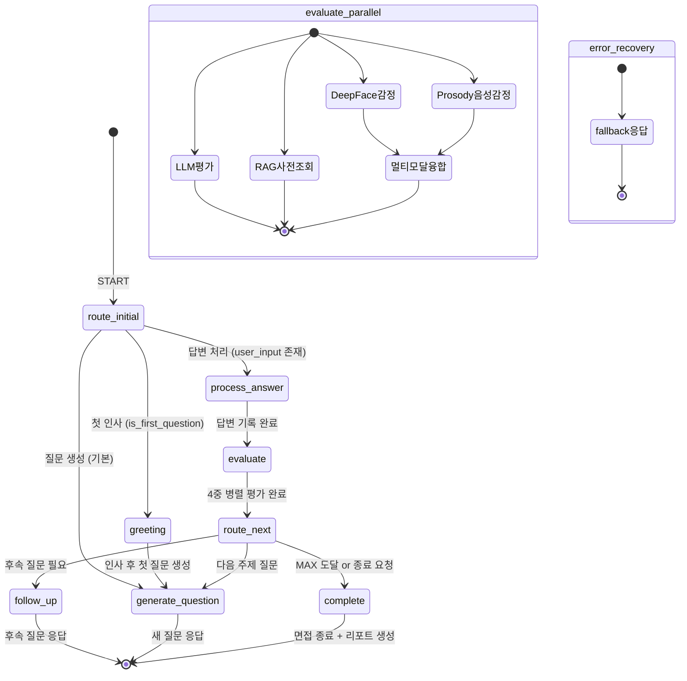

# CSH 폴더 AI 면접 시스템 — LangChain / LangGraph / LLM 아키텍처 분석

> 최초 작성일: 2026-02-11  
> 최종 수정일: 2026-02-24 (LLM 모델 변경, 메모리 통합, LangGraph 독립적 상태 변환, 4중 병렬 evaluate, Celery Dead Code 제거)

---

## 1단계: 전체 아키텍처 개요

이 시스템은 **4개의 핵심 계층**으로 구성됩니다:

| 계층 | 기술 | 역할 |
|---|---|---|
| **LLM 계층** | Ollama `exaone3.5:7.8b` (ChatOllama × 2 인스턴스) | 질문 생성 + 답변 평가 |
| **오케스트레이션 계층** | LangGraph `StateGraph` (8 노드) | 면접 흐름 상태 머신 |
| **데이터 계층** | LangChain `PGVectorStore V2` + `nomic-embed-text` | RAG 이력서/Q&A 검색 |
| **감정 분석 계층** | DeepFace (표정 7종) + Hume Prosody (음성 48종→10지표) | 멀티모달 감정 융합 |

실행 경로는 **이중 경로(Dual-Path)** 로 설계되어 있습니다:
- **Path A (Primary)**: LangGraph StateGraph 기반 실행
- **Path B (Fallback)**: LangGraph 실패 시 절차적(Procedural) 방식으로 직접 실행

---

## 2단계: LLM 계층 — 이중 LLM 인스턴스

`integrated_interview_server.py`의 `AIInterviewer._init_services()`에서 두 개의 `ChatOllama` 인스턴스를 초기화합니다:

```python
# 평가용 (정밀)
self.llm = ChatOllama(
    model=DEFAULT_LLM_MODEL,    # "exaone3.5:7.8b" (Q4_K_M, 4.8GB)
    temperature=0.3,
    num_ctx=DEFAULT_LLM_NUM_CTX, # 8192
)
# 질문 생성용 (창의적)
self.question_llm = ChatOllama(
    model=DEFAULT_LLM_MODEL,
    temperature=DEFAULT_LLM_TEMPERATURE, # 0.7
    num_ctx=DEFAULT_LLM_NUM_CTX,
)
```

> ⚠️ `num_predict`는 설정하지 않음—모델이 `stop` 토큰까지 자연스럽게 생성합니다.

| 인스턴스 | Temperature | num_ctx | 용도 |
|---|---|---|---|
| `question_llm` | 0.7 (높음) | 8192 | 다양한 면접 질문 생성 — 창의성 우선 |
| `llm` | 0.3 (낮음) | 8192 | 답변 평가, JSON 파싱 — 정확성 우선 |

> **VRAM 최적화**: GTX 1660 6GB 환경에서 EXAONE 3.5 7.8B (Q4_K_M, ~4.8GB) + `num_ctx=8192`로 약 5.34GB 사용.
> `OLLAMA_FLASH_ATTENTION=1`과 `OLLAMA_KV_CACHE_TYPE=q8_0`으로 KV Cache 메모리 절감.

LLM 호출은 `ThreadPoolExecutor`를 통해 비동기로 실행됩니다:
- `LLM_EXECUTOR` (4 workers) → `run_llm_async()`
- `RAG_EXECUTOR` (2 workers) → `run_rag_async()`

---

## 3단계: LangGraph StateGraph — 면접 상태 머신

`interview_workflow.py`에서 `StateGraph`를 정의합니다.

### 3-1. 상태 정의 (`WorkflowState` TypedDict)

```python
class WorkflowState(TypedDict, total=False):
    # ── 세션 식별 ──
    session_id: str
    phase: str                          # InterviewPhase enum (10개 상태)

    # ── 입력 / 출력 ──
    user_input: str                     # 사용자 답변
    response: str                       # AI 응답

    # ── 질문 추적 ──
    question_count: int                 # 현재 질문 번호 (1부터)
    max_questions: int                  # 최대 질문 수 (기본 10)
    current_topic: str                  # 현재 질문 주제
    topic_question_count: int           # 해당 주제 내 질문 수
    topic_history: List[Dict]           # 주제 변경 이력

    # ── 꼬리질문 ──
    follow_up_mode: bool
    follow_up_reason: str
    needs_follow_up: bool

    # ── 평가 ──
    last_evaluation: Optional[Dict]     # 직전 답변 평가 결과
    evaluations: List[Dict]             # 누적 평가
    pending_eval_task_id: Optional[str] # Celery 평가 태스크 ID

    # ── 감정 (DeepFace — 표정 7종) ──
    last_emotion: Optional[Dict]        # 직전 감정 분석 결과
    emotion_history: List[Dict]         # 감정 변화 이력
    emotion_adaptive_mode: str          # "normal" | "encouraging" | "challenging"

    # ── 음성 감정 (Hume Prosody — 48종→10지표) ──
    last_prosody: Optional[Dict]        # 직전 Prosody 분석 결과
    prosody_history: List[Dict]         # Prosody 변화 이력

    # ── 대화 기록 ──
    chat_history: List[Dict]

    # ── RAG 사전 조회 결과 (evaluate 노드에서 병렬 조회 → generate_question에서 사용) ──
    rag_resume_context: str             # 이력서 RAG 검색 결과 → LLM 프롬프트에 주입
    rag_qa_context: str                 # Q&A 참조 RAG 검색 결과 → LLM 프롬프트에 주입

    # ── 감사 / 추적 ──
    trace: List[Dict]                   # [{node, timestamp, duration_ms, details}]
    error_info: Optional[str]

    # ── 외부 연결 플래그 ──
    use_rag: bool
    celery_available: bool
    llm_available: bool
```

### 3-2. 10개 Phase (인터뷰 단계)

```python
class InterviewPhase(str, Enum):
    IDLE            # 대기
    GREETING        # 인사
    GENERATE_QUESTION  # 질문 생성
    WAIT_ANSWER     # 답변 대기
    PROCESS_ANSWER  # 답변 처리
    EVALUATE        # 평가
    ROUTE_NEXT      # 분기 결정
    FOLLOW_UP       # 후속 질문
    COMPLETE        # 완료
    ERROR           # 오류
```

### 3-3. 8개 노드 구성

`InterviewNodes` 클래스에서 각 노드를 정의하며, 모든 노드는 `server_state`, `interviewer_instance`, `event_bus`를 주입받습니다:

| 노드 | 역할 | 핵심 로직 |
|---|---|---|
| `greeting` | 첫 인사 | 세션 초기화, 환영 메시지 반환 |
| `process_answer` | 답변 기록 | `user_input`을 세션에 저장, 이전 질문 추출 |
| `evaluate` | **4중 병렬 평가** | `asyncio.gather()`로 LLM 평가 + DeepFace 감정 + Hume Prosody + **RAG 사전 조회** 동시 실행 |
| `route_next` | 분기 결정 | MAX 도달? 후속 필요? 토픽 수? 감정 적응 모드? |
| `generate_question` | 질문 생성 | `build_and_call_llm()` 독립적 상태 변환 — State에서 RAG/감정 컨텍스트 수신 |
| `follow_up` | 후속 질문 | `build_and_call_llm(needs_follow_up=True)` 독립적 상태 변환 |
| `complete` | 면접 종료 | 종료 메시지 + Celery 리포트 생성 트리거 |
| `error_recovery` | 오류 복구 | 안전한 폴백 응답 반환 |

### 3-4. 조건부 엣지 (Conditional Edges)

```
START ─→ route_initial() ─┬─→ greeting        (is_first_question)
                           ├─→ process_answer  (user_input 있음)
                           └─→ generate_question (기본)

greeting ─→ generate_question

process_answer ─→ evaluate

evaluate ─→ route_next

route_next ─→ route_after_routing() ─┬─→ complete          (MAX 도달 or 종료 요청)
                                      ├─→ follow_up         (need_follow_up=True)
                                      └─→ generate_question (다음 질문)

generate_question ─→ END
follow_up ─→ END
complete ─→ END
error_recovery ─→ END
```

### 3-5. StateGraph 다이어그램 (Mermaid)



### 3-6. 체크포인팅 (`MemorySaver`)

```python
from langgraph.checkpoint.memory import MemorySaver

checkpointer = MemorySaver()
graph = workflow.compile(checkpointer=checkpointer)
```

`MemorySaver`는 **세션별 상태를 메모리에 저장**하여 면접 중간에 상태를 복구할 수 있게 합니다. `thread_id` 기반으로 세션을 구분합니다:

```python
config = {"configurable": {"thread_id": session_id}}
result = await graph.ainvoke(initial_state, config=config)
```

---

## 4단계: RAG 시스템 — PGVectorStore V2

`resume_rag.py`에서 벡터 검색 기반 RAG를 구현합니다.

### 4-1. 임베딩 모델

```python
embeddings = OllamaEmbeddings(model="nomic-embed-text")
# 768차원, 8192 토큰 컨텍스트
```

`nomic-embed-text` 최적화로 인덱싱 시 `search_document:` 접두사, 검색 시 `search_query:` 접두사를 사용합니다.

### 4-2. 이중 테이블 구조

| 테이블 | 용도 | 데이터 소스 |
|---|---|---|
| `resume_embeddings` | 이력서 벡터 저장 | PDF 업로드 → PyPDFLoader → 청킹 |
| `qa_embeddings` | 모범답안 참조 데이터 | Q&A 시드 데이터 |

### 4-3. PDF 처리 파이프라인

```
PDF 업로드 → PyPDFLoader → RecursiveCharacterTextSplitter(1500자/300자 오버랩)
→ "search_document:" 접두사 추가 → PGVectorStore.add_documents()
→ PostgreSQL(pgvector) 저장
```

검색 시:
```
질문 → "search_query:" + 질문 → COSINE_DISTANCE 유사도 검색 → top-k 결과 반환
```

---

## 5단계: 질문 생성 파이프라인 — 이중 경로 (Workflow vs Fallback)

### 5-1. Path A: LangGraph `generate_question` / `follow_up` 노드 (독립적 상태 변환)

LangGraph 노드는 `build_and_call_llm()`을 사용하여 **순수 프롬프트 조립 + LLM 호출**만 수행합니다.
RAG 검색, 감정 판단, 주제 추적 등 모든 데이터는 **State를 통해 이전 노드에서 전달**됩니다:

```
evaluate 노드에서 병렬 조회:
   ├─ _fetch_rag() → rag_resume_context, rag_qa_context → State 저장
   ├─ 감정 분석 → emotion_adaptive_mode → State 저장
   └─ 평가 → eval_result → State 저장
     ↓
generate_question / follow_up 노드:
   │  State에서 수신:
   │    resume_context = ws["rag_resume_context"]
   │    qa_context = ws["rag_qa_context"]
   │    emotion_mode = ws["emotion_adaptive_mode"]
   │    follow_up_reason = ws["follow_up_reason"]
   └─→ build_and_call_llm(순수 LLM 호출) → response
```

> 이전 Thin Wrapper 방식에서는 `generate_llm_question()` 안에서 RAG 검색, 팔단, 메모리를 모두 처리했으나,
> 독립적 상태 변환 패턴으로 리팩토링하여 각 노드의 책임이 명확해졌습니다.

### 5-2. Path B: Procedural Fallback — `generate_llm_question()` (8단계 프로세스)

LangGraph 실패 시 폴백으로 사용되는 `AIInterviewer.generate_llm_question()`의 실행 흐름:

```
① 세션 메모리 초기화/로드
        ↓
② 후속 질문 필요 여부 판단 (should_follow_up)
        ↓
③ RAG 이력서 컨텍스트 검색 (run_rag_async → ThreadPoolExecutor)
  ③-1. Q&A 모범답안 검색 (qa_embeddings)
        ↓
④ chat_history → LangChain 메시지 변환
   SystemMessage → [AIMessage, HumanMessage, AIMessage, ...] 순서로
        ↓
⑤ 이력서 RAG 컨텍스트를 SystemMessage로 주입
  ⑤-1. Q&A 참조 컨텍스트를 SystemMessage로 주입
        ↓
⑥ 질문 생성 프롬프트 구성
   - 후속 질문 지시사항
   - 토픽 추적 (topic_tracking)
   - 질문 번호 (question_count)
   - emotion_adaptive_mode 반영
        ↓
⑦ LLM 호출 (question_llm, temp=0.7) via run_llm_async
        ↓
⑧ 토픽 추적 업데이트 + 메모리 저장
```

---

## 6단계: 평가 시스템

### 6-1. evaluate 노드의 4중 병렬 실행

`interview_workflow.py`의 `evaluate` 노드는 4개의 코루틴을 `asyncio.gather()`로 동시 실행합니다:

```python
async def _run_evaluation():   # ① LLM 답변 평가 (Celery or 로컬)
async def _run_emotion():      # ② DeepFace 표정 감정 수집
async def _run_prosody():      # ③ Hume Prosody 음성 감정 수집
async def _fetch_rag():        # ④ RAG 컨텍스트 사전 조회 (질문 생성 노드에서 사용)

await asyncio.gather(_run_evaluation(), _run_emotion(), _run_prosody(), _fetch_rag())
```

```
┌────────────────────────────────────────────────────────────────┐
│                    asyncio.gather() 4중 병렬 실행                  │
│                                                                  │
│  ┌───────────────┐  ┌──────────────┐  ┌────────────┐  ┌──────────┐ │
│  │ _run_eval()   │  │ _run_emotion()│  │ _run_prosd()│  │_fetch_rag()│ │
│  │               │  │              │  │            │  │           │ │
│  │ Celery 평가    │  │ DeepFace 7감정│  │ Prosody    │  │ RAG 사전  │ │
│  │  or 로컬 LLM   │  │ probabilities│  │ 48감정→10  │  │ 조회(2테이블)│ │
│  └────────┬──────┘  └────────┬─────┘  └──────┬─────┘  └─────┬────┘ │
│           ▼                ▼              ▼              ▼          │
│      eval_result      emotion_result  prosody_result  rag_ctx    │
└────────────────────────────────────────────────────────────────┘
         │                    │              │              │
         │                    ▼              ▼              │
         │       ┌────────────────────────────────┐        │
         │       │      멀티모달 감정 융합 결정          │        │
         │       │  merge_with_deepface()             │        │
         │       │  Prosody 50% + DeepFace 50%        │        │
         │       │  → emotion_adaptive_mode 산출       │        │
         │       └────────────────────────────────┘        │
         │                                                   │
         ▼                                                   ▼
    State로 전달 → generate_question / follow_up 노드에서 사용
```

> ⚡ **성능 최적화**: RAG 검색(~2초)을 평가(~3초)와 병렬 실행하여,
> `generate_question` 시점에는 이미 State에 RAG 결과가 준비되어 LLM 호출만 수행합니다.

### 6-2. 멀티모달 적응 모드 결정 (3단계 폴백)

두 감정 분석 소스의 가용 여부에 따라 3단계로 적응 모드를 결정합니다:

| 우선순위 | 조건 | 방식 | 정밀도 |
|---|---|---|---|
| **1순위** | Prosody + DeepFace 둘 다 있음 | `merge_with_deepface()` — 10지표 공간에서 가중 평균 (50:50) | ★★★★★ |
| **2순위** | Prosody만 있음 | 48감정→10지표 기반 `determine_emotion_adaptive_mode()` | ★★★★ |
| **3순위** | DeepFace만 있음 (폴백) | 7감정의 `dominant_emotion` 문자열 매칭 | ★★ |

```python
# 1순위: 멀티모달 융합
if prosody_result and emotion_result:
    fusion = svc.merge_with_deepface(
        prosody_indicators=prosody_result["interview_indicators"],
        deepface_emotion=emotion_result,
        prosody_weight=0.5,  # 50:50 균등 가중
    )
    emotion_adaptive_mode = fusion["emotion_adaptive_mode"]

# 2순위: Prosody 단독
elif prosody_result:
    emotion_adaptive_mode = prosody_result["adaptive_mode"]

# 3순위: DeepFace 단독 (폴백)
elif emotion_result:
    dominant = emotion_result["dominant_emotion"]
    if dominant in ("sad", "fear", "disgust"):
        emotion_adaptive_mode = "encouraging"
    elif dominant in ("happy", "surprise"):
        emotion_adaptive_mode = "challenging"
    else:
        emotion_adaptive_mode = "normal"
```

### 6-3. 평가 기준


### 6-4. Celery 백그라운드 오프로드

`celery_tasks.py`의 `evaluate_answer_task`:

```
답변 입력 → Celery Task 큐잉 (Redis Broker)
→ Worker에서 ChatOllama(temp=0.3) + EVALUATION_PROMPT 실행
→ Worker 내부 RAG 자체 조회 (⚡ resume_context 가 비어있으면 Fallback)
→ JSON Resilience 파싱 (json_utils.py)
→ Redis Pub/Sub 이벤트 발행 ("evaluation.completed")
→ 재시도 3회, 소프트 타임아웃 60초
```

> ℹ️ `generate_question_task`는 Dead Code로 확인되어 **제거**되었습니다 (0개의 `.delay()` 호출).

---

## 7단계: 감정 적응(Emotion-Adaptive) 라우팅

### 7-1. 이중 감정 소스

| 소스 | 기술 | 감정 수 | 입력 | 면접 지표 |
|---|---|---|---|---|
| **DeepFace** | 표정 분석 | 7종 | 비디오 프레임 (1fps) | `dominant_emotion` 문자열 |
| **Hume Prosody** | 음성 톤 분석 | 48종→10지표 | 오디오 PCM (발화 단위) | 자신감·불안·집중·당황·긍정·진정·부정·슬픔·놀람·피로 |

### 7-2. 48종→10종 매핑 이유

Hume Prosody의 48종 감정은 일상 감정 분류 체계이므로 면접 도메인에 직접 사용하기 어렵습니다:

```python
INTERVIEW_EMOTION_MAP = {
    "confidence":  ["Determination", "Pride", "Triumph"],       # 자신감
    "anxiety":     ["Anxiety", "Fear", "Distress"],             # 불안
    "focus":       ["Concentration", "Contemplation", "Interest"], # 집중
    "confusion":   ["Confusion", "Awkwardness", "Embarrassment"],  # 당황
    "positivity":  ["Joy", "Satisfaction", "Excitement"],        # 긍정
    "calmness":    ["Calmness", "Contentment", "Relief"],       # 진정
    "negativity":  ["Anger", "Disgust", "Contempt"],            # 부정
    "sadness":     ["Sadness", "Disappointment", "Doubt"],      # 슬픔
    "surprise":    ["Surprise (positive)", "Surprise (negative)", "Realization"], # 놀람
    "fatigue":     ["Boredom", "Tiredness"],                    # 피로
}
```

- 면접과 무관한 감정(Craving, Romance, Nostalgia 등)을 제거하여 **노이즈 감소**
- 의미적으로 유사한 감정을 그룹 평균으로 묶어 **안정적 지표** 생성
- DeepFace 7감정과 **동일 차원(10종 지표)** 으로 정규화하여 가중 융합 가능
- 면접관/리포트에 **직관적으로 유의미한** 지표 제공 (자신감, 불안, 집중도 등)

### 7-3. 멀티모달 융합 (`merge_with_deepface`)

양쪽 데이터가 모두 있을 때 10종 지표 공간에서 가중 평균으로 융합합니다:

```python
# DeepFace 7감정 → 10종 지표 변환
deepface_indicators = {
    "confidence": happy * 0.5 + surprise * 0.3,
    "anxiety":    fear * 0.6 + sad * 0.3,
    "focus":      neutral * 0.7,
    ...
}

# 가중 평균 (50:50)
for key in INTERVIEW_EMOTION_MAP:
    merged[key] = prosody[key] * 0.5 + deepface[key] * 0.5
```

### 7-4. 적응 모드 결정 규칙

`determine_emotion_adaptive_mode()`는 융합된 10종 지표로 모드를 결정합니다:

| 모드 | 조건 | 효과 |
|---|---|---|
| `encouraging` | `(anxiety + sadness + negativity) / 3 > 0.15` 또는 `confusion > 0.2` | 후속 질문 억제, 격려형 질문 생성 |
| `challenging` | `(confidence + positivity) / 2 > 0.2` | 심화 질문 생성 |
| `normal` | 기본 | 표준 흐름 |

`route_next` 노드에서 `encouraging` 모드일 경우 `need_follow_up=False`로 강제 설정하여 압박 질문을 방지합니다.

### 7-5. 이벤트 시스템 연동

```
PROSODY_ANALYZED → on_prosody_analyzed (핸들러)
                       │
                       ├─ anxiety > 60% → PROSODY_ALERT 발행
                       │                    → "면접자의 음성에서 높은 긴장 감지"
                       └─ adaptive_mode 결정 보조

EMOTION_ANALYZED → on_emotion_analyzed (기존)
                       │
                       └─ negative + confidence > 70% → EMOTION_ALERT 발행
```

---

## 8단계: 메모리 관리 — `chat_history` 단일 소스

이전에는 `session["memory"]` (LangChain 메시지 리스트)와 `session["chat_history"]` (덱셔너리 리스트)가 이중으로 관리되었으나, **통합되어 `chat_history` 단일 소스**로 바뀌었습니다.

```python
# 세션별 대화 기록 (단일 소스)
session["chat_history"] = [
    {"role": "assistant", "content": "안녕하세요..."},
    {"role": "user", "content": "저는 3년차..."},
    ...
]

# LLM 호출 시: chat_history → LangChain 메시지 변환 (정적 유틸리티)
@staticmethod
def chat_history_to_messages(chat_history, system_prompt):
    messages = [SystemMessage(content=system_prompt)]
    for msg in chat_history:
        if msg["role"] == "assistant":
            messages.append(AIMessage(content=msg["content"]))
        elif msg["role"] == "user":
            messages.append(HumanMessage(content=msg["content"]))
    return messages
```

**제거된 코드:**
- `init_session_memory()` — 세션 메모리 초기화
- `save_to_memory()` — 메시지 이중 저장
- `get_memory_messages()` — 메모리 미러링
- `session["memory"]` — 이중 관리 필드
- `WorkflowState.memory_messages` — State 필드

---

## 9단계: 실행 흐름 종합 (사용자 답변 1회 기준)

```
사용자 답변 (WebSocket) ─────────────────────┐
    ↓                                          │ 동시에
오디오 트랙 (WebRTC) ──→ Deepgram STT          │ 오디오 버퍼 축적
                             ↓ (is_final)       │      ↓
                         STT 텍스트 반환         │  WAV 변환 → Hume Prosody API
                                                │      ↓
                                                │  prosody_result (10지표)
                                                │
비디오 트랙 (WebRTC) ──→ DeepFace (1fps)        │
                             ↓                  │
                         emotion_result (7감정)  │
    ↓                                          │
generate_response()  ← AIInterviewer 진입점    │
    ↓                                          │
┌─ Path A: LangGraph ────────────────────────────────────────────┐
│  interview_workflow.run(session_id, user_input)                │
│      ↓                                                          │
│  route_initial() → process_answer                               │
│      ↓                                                          │
│  evaluate (asyncio.gather 4중 병렬):                            │
│      ├─ _run_evaluation()  → LLM평가 or Celery 오프로드        │
│      ├─ _run_emotion()     → DeepFace 최신 데이터 수집          │
│      ├─ _run_prosody()     → Prosody 최신 데이터 수집           │
│      └─ _fetch_rag()       → RAG 사전 조회 (resume + Q&A)    │
│      ↓                                                          │
│  멀티모달 융합 (Prosody 50% + DeepFace 50%)                    │
│      → emotion_adaptive_mode 결정                               │
│      ↓                                                          │
│  route_next → generate_question or follow_up or complete       │
│      ↓  (build_and_call_llm — State에서 RAG/감정 컨텍스트 수신) │
│  응답 반환 → END                                                │
└─────────────────────────────────────────────────────────────────┘
    ↓ (실패 시)
┌─ Path B: Procedural Fallback ──────────────────────────────────┐
│  세션 관리 → Celery 백그라운드 평가 큐잉                        │
│      ↓                                                          │
│  generate_llm_question() (8단계 파이프라인)                     │
│      ↓                                                          │
│  응답 반환                                                      │
└─────────────────────────────────────────────────────────────────┘
```

---

## 핵심 구조 요약

1. **LangGraph StateGraph**가 면접의 **전체 흐름을 제어**하는 상태 머신 역할
2. **이중 LLM** (`temp=0.7` 질문 / `temp=0.3` 평가)으로 목적에 맞는 추론 수행 (모델: EXAONE 3.5 7.8B, num_ctx=8192)
3. **RAG (PGVectorStore V2)** 가 이력서 + 모범답안 컨텍스트를 실시간 주입
4. **Celery + Redis**가 평가/리포트 등 무거운 작업을 비동기 오프로드
5. **멀티모달 감정 융합** (Prosody 50% + DeepFace 50%)이 10종 통합 지표를 산출
6. **4중 병렬 evaluate** 노드에서 LLM평가 + 표정분석 + 음성감정 + **RAG 사전 조회**를 동시 실행
7. **3단계 폴백 적응 모드**: 멀티모달 융합 → Prosody 단독 → DeepFace 단독
8. **독립적 상태 변환**: 각 노드가 State에서 데이터를 수신하여 순수 LLM 호출만 수행
9. **메모리 통합**: `chat_history` 단일 소스 (이중 관리 제거) + `chat_history_to_messages()` 정적 변환
10. **MemorySaver 체크포인팅**으로 세션 중간 복구 지원

---

## 관련 소스 파일

| 파일 | 역할 |
|---|---|
| `interview_workflow.py` | LangGraph StateGraph 정의 (8 노드, 4중 병렬 evaluate, 독립적 상태 변환, 멀티모달 라우팅) |
| `integrated_interview_server.py` | AIInterviewer 클래스 (이중 LLM, 오디오 파이프라인, Prosody 분석 함수) |
| `hume_prosody_service.py` | Hume Prosody 서비스 (48감정→10지표, Batch/Streaming API, 멀티모달 융합) |
| `resume_rag.py` | RAG 시스템 (PGVectorStore V2, nomic-embed-text) |
| `celery_tasks.py` | 비동기 태스크 (evaluate_answer_task RAG fallback, 리포트 + Prosody 통계). generate_question_task 제거됨 |
| `celery_app.py` | Celery 앱 설정 (Redis Broker) |
| `events.py` | 이벤트 타입 정의 (PROSODY_ANALYZED, PROSODY_ALERT 포함) |
| `event_handlers.py` | 이벤트 핸들러 (Prosody 불안 알림 핸들러 포함) |
| `prompt_templates.py` | 면접 프롬프트 템플릿 관리 (질문/평가/팔로우업 프롬프트) |
| `json_utils.py` | JSON Resilience 파싱 유틸리티 |
