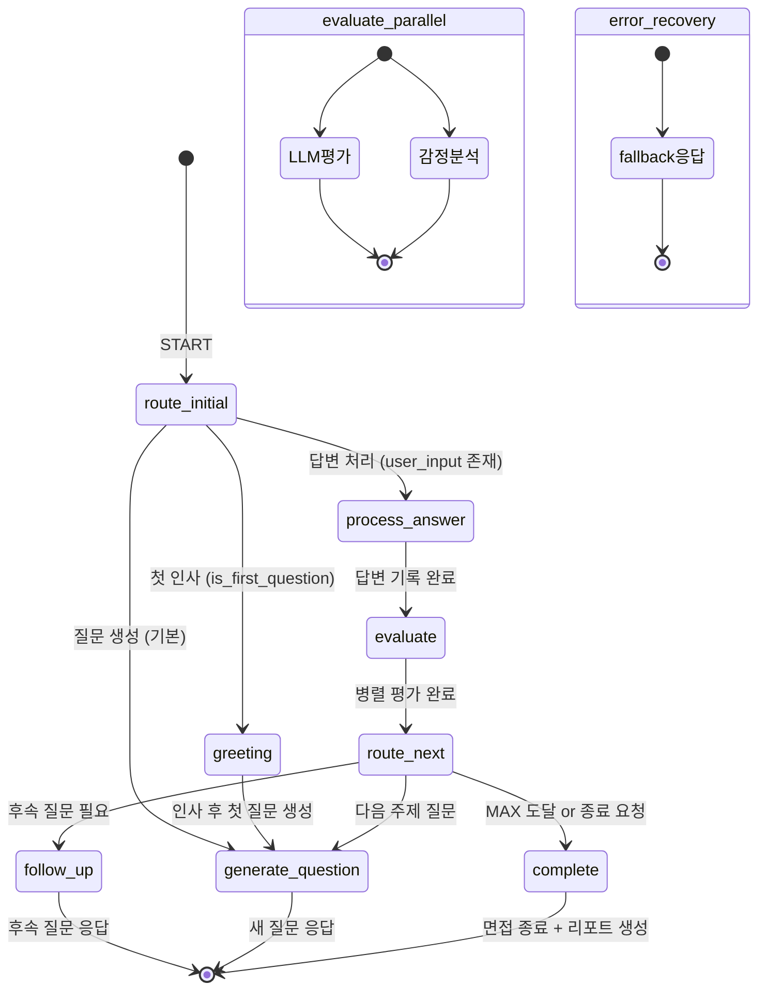

# CSH 폴더 AI 면접 시스템 — LangChain / LangGraph / LLM 아키텍처 분석

> 작성일: 2026-02-11

---

## 1단계: 전체 아키텍처 개요

이 시스템은 **3개의 핵심 계층**으로 구성됩니다:

| 계층 | 기술 | 역할 |
|---|---|---|
| **LLM 계층** | Ollama `qwen3:4b` (ChatOllama × 2 인스턴스) | 질문 생성 + 답변 평가 |
| **오케스트레이션 계층** | LangGraph `StateGraph` (8 노드) | 면접 흐름 상태 머신 |
| **데이터 계층** | LangChain `PGVectorStore V2` + `nomic-embed-text` | RAG 이력서/Q&A 검색 |

실행 경로는 **이중 경로(Dual-Path)** 로 설계되어 있습니다:
- **Path A (Primary)**: LangGraph StateGraph 기반 실행
- **Path B (Fallback)**: LangGraph 실패 시 절차적(Procedural) 방식으로 직접 실행

---

## 2단계: LLM 계층 — 이중 LLM 인스턴스

`integrated_interview_server.py`의 `AIInterviewer._init_services()`에서 두 개의 `ChatOllama` 인스턴스를 초기화합니다:

```python
# 질문 생성용 (창의적)
self.question_llm = ChatOllama(model="qwen3:4b", temperature=0.7, num_ctx=16384)

# 평가용 (정밀)  
self.llm = ChatOllama(model="qwen3:4b", temperature=0.3, num_ctx=16384)
```

| 인스턴스 | Temperature | 용도 |
|---|---|---|
| `question_llm` | 0.7 (높음) | 다양한 면접 질문 생성 — 창의성 우선 |
| `llm` | 0.3 (낮음) | 답변 평가, JSON 파싱 — 정확성 우선 |

LLM 호출은 `ThreadPoolExecutor`를 통해 비동기로 실행됩니다:
- `LLM_EXECUTOR` (4 workers) → `run_llm_async()`
- `RAG_EXECUTOR` (2 workers) → `run_rag_async()`

---

## 3단계: LangGraph StateGraph — 면접 상태 머신

`interview_workflow.py`에서 `StateGraph`를 정의합니다.

### 3-1. 상태 정의 (`WorkflowState` TypedDict)

```python
class WorkflowState(TypedDict):
    session_id: str
    phase: str              # InterviewPhase enum (10개 상태)
    user_input: str         # 사용자 답변
    response: str           # AI 응답
    question_count: int     # 현재 질문 번호
    max_questions: int      # 최대 질문 수
    follow_up_count: int    # 후속 질문 횟수
    need_follow_up: bool    # 후속 질문 필요 여부
    evaluation_result: dict # 평가 결과
    emotion_data: dict      # 감정 분석 데이터
    emotion_adaptive_mode: str  # encouraging/challenging/normal
    chat_history: list      # 대화 이력
    # ... 기타 추적 필드
```

### 3-2. 10개 Phase (인터뷰 단계)

```python
class InterviewPhase(str, Enum):
    IDLE            # 대기
    GREETING        # 인사
    GENERATE_QUESTION  # 질문 생성
    WAIT_ANSWER     # 답변 대기
    PROCESS_ANSWER  # 답변 처리
    EVALUATE        # 평가
    ROUTE_NEXT      # 분기 결정
    FOLLOW_UP       # 후속 질문
    COMPLETE        # 완료
    ERROR           # 오류
```

### 3-3. 8개 노드 구성

`InterviewNodes` 클래스에서 각 노드를 정의하며, 모든 노드는 `server_state`, `interviewer_instance`, `event_bus`를 주입받습니다:

| 노드 | 역할 | 핵심 로직 |
|---|---|---|
| `greeting` | 첫 인사 | 세션 초기화, 환영 메시지 반환 |
| `process_answer` | 답변 기록 | `user_input`을 세션에 저장, 이전 질문 추출 |
| `evaluate` | **병렬 평가** | `asyncio.gather()`로 LLM 평가 + 감정 분석 동시 실행 |
| `route_next` | 분기 결정 | MAX 도달? 후속 필요? 토픽 수? 감정 적응 모드? |
| `generate_question` | 질문 생성 | `AIInterviewer.generate_llm_question()` 호출 |
| `follow_up` | 후속 질문 | `follow_up_mode=True`로 질문 생성 |
| `complete` | 면접 종료 | 종료 메시지 + Celery 리포트 생성 트리거 |
| `error_recovery` | 오류 복구 | 안전한 폴백 응답 반환 |

### 3-4. 조건부 엣지 (Conditional Edges)

```
START ─→ route_initial() ─┬─→ greeting        (is_first_question)
                           ├─→ process_answer  (user_input 있음)
                           └─→ generate_question (기본)

greeting ─→ generate_question

process_answer ─→ evaluate

evaluate ─→ route_next

route_next ─→ route_after_routing() ─┬─→ complete          (MAX 도달 or 종료 요청)
                                      ├─→ follow_up         (need_follow_up=True)
                                      └─→ generate_question (다음 질문)

generate_question ─→ END
follow_up ─→ END
complete ─→ END
error_recovery ─→ END
```

### 3-5. StateGraph 다이어그램 (Mermaid)



### 3-6. 체크포인팅 (`MemorySaver`)

```python
from langgraph.checkpoint.memory import MemorySaver

checkpointer = MemorySaver()
graph = workflow.compile(checkpointer=checkpointer)
```

`MemorySaver`는 **세션별 상태를 메모리에 저장**하여 면접 중간에 상태를 복구할 수 있게 합니다. `thread_id` 기반으로 세션을 구분합니다:

```python
config = {"configurable": {"thread_id": session_id}}
result = await graph.ainvoke(initial_state, config=config)
```

---

## 4단계: RAG 시스템 — PGVectorStore V2

`resume_rag.py`에서 벡터 검색 기반 RAG를 구현합니다.

### 4-1. 임베딩 모델

```python
embeddings = OllamaEmbeddings(model="nomic-embed-text")
# 768차원, 8192 토큰 컨텍스트
```

`nomic-embed-text` 최적화로 인덱싱 시 `search_document:` 접두사, 검색 시 `search_query:` 접두사를 사용합니다.

### 4-2. 이중 테이블 구조

| 테이블 | 용도 | 데이터 소스 |
|---|---|---|
| `resume_embeddings` | 이력서 벡터 저장 | PDF 업로드 → PyPDFLoader → 청킹 |
| `qa_embeddings` | 모범답안 참조 데이터 | Q&A 시드 데이터 |

### 4-3. PDF 처리 파이프라인

```
PDF 업로드 → PyPDFLoader → RecursiveCharacterTextSplitter(1500자/300자 오버랩)
→ "search_document:" 접두사 추가 → PGVectorStore.add_documents()
→ PostgreSQL(pgvector) 저장
```

검색 시:
```
질문 → "search_query:" + 질문 → COSINE_DISTANCE 유사도 검색 → top-k 결과 반환
```

---

## 5단계: 질문 생성 파이프라인 — 8단계 프로세스

`AIInterviewer.generate_llm_question()`의 실행 흐름:

```
① 세션 메모리 초기화/로드
        ↓
② 후속 질문 필요 여부 판단 (should_follow_up)
        ↓
③ RAG 이력서 컨텍스트 검색 (run_rag_async → ThreadPoolExecutor)
  ③-1. Q&A 모범답안 검색 (qa_embeddings)
        ↓
④ chat_history → LangChain 메시지 변환
   SystemMessage → [AIMessage, HumanMessage, AIMessage, ...] 순서로
        ↓
⑤ 이력서 RAG 컨텍스트를 SystemMessage로 주입
  ⑤-1. Q&A 참조 컨텍스트를 SystemMessage로 주입
        ↓
⑥ 질문 생성 프롬프트 구성
   - 후속 질문 지시사항
   - 토픽 추적 (topic_tracking)
   - 질문 번호 (question_count)
   - emotion_adaptive_mode 반영
        ↓
⑦ LLM 호출 (question_llm, temp=0.7) via run_llm_async
        ↓
⑧ 토픽 추적 업데이트 + 메모리 저장
```

---

## 6단계: 평가 시스템

### 6-1. 평가 노드의 병렬 실행

`interview_workflow.py`의 `evaluate` 노드:

```python
eval_result, emotion_result = await asyncio.gather(
    llm_evaluation_coro,    # LLM 평가 (Celery or 로컬)
    emotion_analysis_coro   # 감정 분석
)
```

### 6-2. 평가 기준


### 6-3. Celery 백그라운드 오프로드

`celery_tasks.py`의 `evaluate_answer_task`:

```
답변 입력 → Celery Task 큐잉 (Redis Broker)
→ Worker에서 ChatOllama(temp=0.3) + EVALUATION_PROMPT 실행
→ JSON Resilience 파싱 (json_utils.py)
→ Redis Pub/Sub 이벤트 발행 ("evaluation.completed")
→ 재시도 3회, 소프트 타임아웃 60초
```

---

## 7단계: 감정 적응(Emotion-Adaptive) 라우팅

`evaluate` 노드에서 감정 분석 결과에 따라 `emotion_adaptive_mode`를 설정합니다:

| 모드 | 조건 | 효과 |
|---|---|---|
| `encouraging` | 부정적 감정 감지 | 후속 질문 억제, 격려형 질문 생성 |
| `challenging` | 높은 자신감 감지 | 심화 질문 생성 |
| `normal` | 기본 | 표준 흐름 |

`route_next` 노드에서 `encouraging` 모드일 경우 `need_follow_up=False`로 강제 설정하여 압박 질문을 방지합니다.

---

## 8단계: 메모리 관리

LangChain의 `ChatMessageHistory`를 수동으로 관리합니다:

```python
# 세션별 메모리 딕셔너리
self.session_memories: Dict[str, list] = {}

# 메시지 저장
def save_to_memory(session_id, role, content):
    if role == "ai":
        self.session_memories[session_id].append(AIMessage(content=content))
    else:
        self.session_memories[session_id].append(HumanMessage(content=content))
```

질문 생성 시 이 메모리를 `SystemMessage → AIMessage → HumanMessage → ...` 순서의 LangChain 메시지 리스트로 변환하여 LLM에 전달합니다.

---

## 9단계: 실행 흐름 종합 (사용자 답변 1회 기준)

```
사용자 답변 (WebSocket)
    ↓
generate_response()  ← AIInterviewer 진입점
    ↓
┌─ Path A: LangGraph ────────────────────────────────────┐
│  interview_workflow.run(session_id, user_input)        │
│      ↓                                                  │
│  route_initial() → process_answer                       │
│      ↓                                                  │
│  evaluate (asyncio.gather: LLM평가 + 감정분석)          │
│      ↓                                                  │
│  route_next → generate_question or follow_up or complete│
│      ↓                                                  │
│  응답 반환 → END                                        │
└─────────────────────────────────────────────────────────┘
    ↓ (실패 시)
┌─ Path B: Procedural Fallback ──────────────────────────┐
│  세션 관리 → Celery 백그라운드 평가 큐잉                 │
│      ↓                                                  │
│  generate_llm_question() (8단계 파이프라인)              │
│      ↓                                                  │
│  응답 반환                                               │
└─────────────────────────────────────────────────────────┘
```

---

## 핵심 구조 요약

1. **LangGraph StateGraph**가 면접의 **전체 흐름을 제어**하는 상태 머신 역할
2. **이중 LLM** (`temp=0.7` 질문 / `temp=0.3` 평가)으로 목적에 맞는 추론 수행
3. **RAG (PGVectorStore V2)** 가 이력서 + 모범답안 컨텍스트를 실시간 주입
4. **Celery + Redis**가 평가/리포트 등 무거운 작업을 비동기 오프로드
5. **감정 적응 라우팅**이 면접자의 상태에 따라 동적으로 질문 전략을 변경
6. **MemorySaver 체크포인팅**으로 세션 중간 복구 지원

---

## 관련 소스 파일

| 파일 | 역할 |
|---|---|
| `interview_workflow.py` | LangGraph StateGraph 정의 (8 노드, 조건부 엣지) |
| `integrated_interview_server.py` | AIInterviewer 클래스 (이중 LLM, 8단계 질문 파이프라인) |
| `resume_rag.py` | RAG 시스템 (PGVectorStore V2, nomic-embed-text) |
| `celery_tasks.py` | 비동기 태스크 (평가, 리포트, 질문 생성) |
| `celery_app.py` | Celery 앱 설정 (Redis Broker) |
| `json_utils.py` | JSON Resilience 파싱 유틸리티 |
