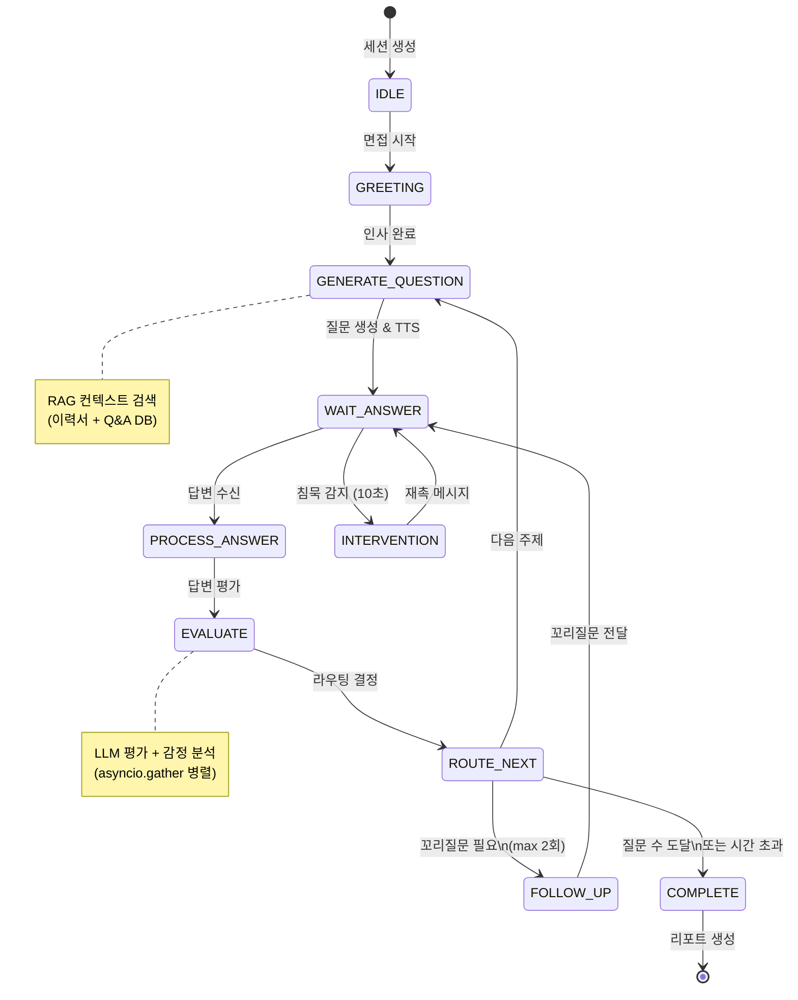
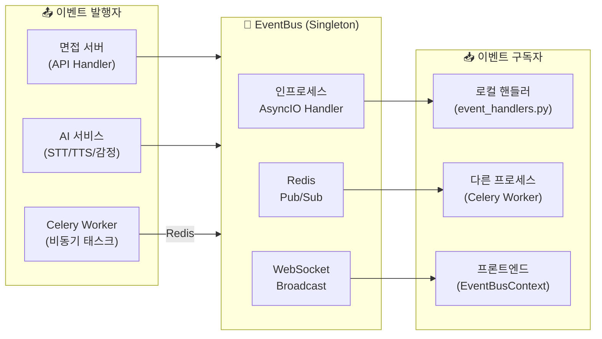
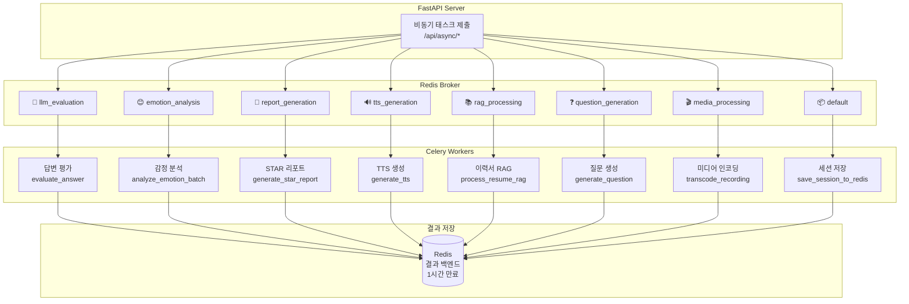
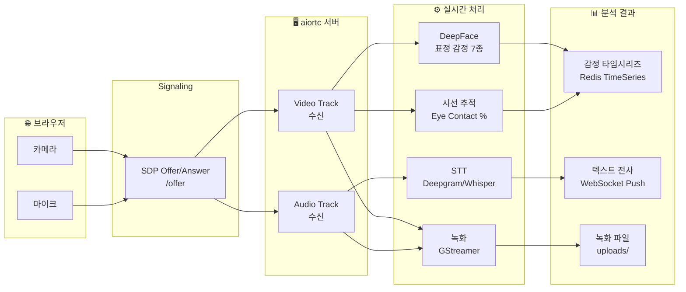
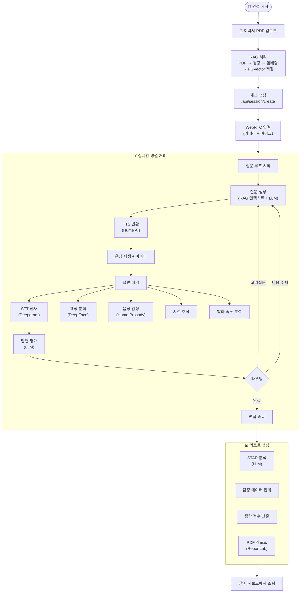

# 🏗️ AI 모의면접 시스템 — 아키텍처 다이어그램

> 본 문서는 CSH 폴더 내 AI 면접 시스템의 전체 아키텍처를 Mermaid 다이어그램으로 시각화합니다.
> 
> 마지막 업데이트: 2026-02-12

---

## 1. 전체 시스템 아키텍처 (High-Level)

```mermaid
graph TB
    subgraph CLIENT["🖥️ Presentation Layer (Next.js)"]
        direction LR
        LANDING["랜딩"]
        DASHBOARD["📊 dashboard<br/>대시보드"]
        INTERVIEW["🎤 interview<br/>면접 진행"]
        CODING["💻 coding<br/>코딩 테스트"]
        WHITEBOARD["🎨 whiteboard<br/>화이트보드"]
        EMOTION["😊 emotion<br/>감정 차트"]
        PROFILE["👤 profile<br/>프로필"]
        SETTINGS["⚙️ settings<br/>설정"]
    end

    subgraph GATEWAY["🔀 Gateway / API Layer (FastAPI)"]
        direction LR
        API_SERVER["integrated_interview_server.py<br/>80+ REST 엔드포인트"]
        WS_SERVER["WebSocket Server<br/>/ws/interview/{id}"]
        WEBRTC["WebRTC Signaling<br/>/offer (aiortc)"]
        PROXY["Next.js Proxy<br/>/_next/*, 페이지 라우트"]
    end

    subgraph AI["🧠 AI / ML Processing Layer"]
        direction TB
        subgraph LLM_ENGINE["LLM 대화 엔진"]
            WORKFLOW["interview_workflow.py<br/>LangGraph 상태머신"]
            TEXT_IV["text_interview.py<br/>텍스트 면접"]
        end
        subgraph RAG_SYS["RAG 시스템"]
            RESUME_RAG["resume_rag.py<br/>PGVector + OllamaEmbeddings"]
        end
        subgraph STT_SYS["STT 엔진"]
            STT["stt_engine.py<br/>Deepgram 실시간"]
            WHISPER["whisper_stt_service.py<br/>Whisper 폴백"]
        end
        subgraph TTS_SYS["TTS 엔진"]
            TTS["hume_tts_service.py<br/>Hume AI EVI"]
        end
        subgraph EMOTION_SYS["감정 분석 (멀티모달)"]
            PROSODY["hume_prosody_service.py<br/>음성 감정 48종"]
            DEEPFACE["DeepFace<br/>표정 감정 7종"]
        end
        subgraph OTHER_AI["기타 AI 서비스"]
            CODE_EXEC["code_execution_service.py<br/>Docker 샌드박스"]
            WB_SVC["whiteboard_service.py<br/>Vision AI 분석"]
            DID["did_avatar_service.py<br/>D-ID 아바타"]
            SPEECH["speech_analysis_service.py<br/>발화 속도 분석"]
            GAZE["gaze_tracking_service.py<br/>시선 추적"]
        end
    end

    subgraph REALTIME["⚡ Real-time Processing Layer"]
        direction LR
        EVENT_BUS["event_bus.py<br/>이벤트 디스패처"]
        EVENTS["events.py<br/>30+ EventType"]
        HANDLERS["event_handlers.py<br/>핸들러 등록"]
        MEDIA_REC["media_recording_service.py<br/>GStreamer 녹화"]
    end

    subgraph ASYNC["⏳ Background Processing (Celery)"]
        direction LR
        CELERY_APP["celery_app.py<br/>8개 전용 큐"]
        CELERY_TASKS["celery_tasks.py<br/>비동기 태스크"]
    end

    subgraph DATA["💾 Data Layer"]
        direction LR
        POSTGRES[("PostgreSQL<br/>+ pgvector")]
        REDIS[("Redis<br/>Cache / Broker")]
        FILE_STORE[("📁 File Storage<br/>uploads/")]
    end

    subgraph SECURITY["🔒 Security Layer"]
        SEC["security.py<br/>JWT + bcrypt"]
        LATENCY["latency_monitor.py<br/>SLA 모니터링"]
        JSON_UTIL["json_utils.py<br/>LLM JSON 파싱"]
    end

    %% Client → Gateway
    CLIENT -->|"REST API<br/>fetch()"| API_SERVER
    CLIENT -->|"WebSocket"| WS_SERVER
    CLIENT -->|"WebRTC<br/>MediaStream"| WEBRTC
    API_SERVER -->|"Proxy"| PROXY

    %% Gateway → AI
    API_SERVER --> WORKFLOW
    API_SERVER --> TEXT_IV
    API_SERVER --> RESUME_RAG
    API_SERVER --> STT
    API_SERVER --> WHISPER
    API_SERVER --> TTS
    API_SERVER --> PROSODY
    API_SERVER --> DEEPFACE
    API_SERVER --> CODE_EXEC
    API_SERVER --> WB_SVC
    API_SERVER --> DID
    API_SERVER --> SPEECH
    API_SERVER --> GAZE

    %% AI 내부
    WORKFLOW --> RESUME_RAG
    WEBRTC --> STT
    WEBRTC --> DEEPFACE
    WEBRTC --> GAZE
    WEBRTC --> MEDIA_REC

    %% Real-time
    API_SERVER --> EVENT_BUS
    EVENT_BUS --> EVENTS
    EVENT_BUS --> HANDLERS
    EVENT_BUS -->|"WebSocket Push"| WS_SERVER
    EVENT_BUS -->|"Redis Pub/Sub"| REDIS

    %% Async
    API_SERVER -->|"태스크 제출"| CELERY_TASKS
    CELERY_TASKS --> CELERY_APP
    CELERY_APP --> REDIS

    %% Data
    API_SERVER --> POSTGRES
    RESUME_RAG --> POSTGRES
    API_SERVER --> REDIS
    API_SERVER --> FILE_STORE
    MEDIA_REC --> FILE_STORE

    %% Security
    API_SERVER --> SEC
    API_SERVER --> LATENCY
    API_SERVER --> JSON_UTIL

    %% Styling
    classDef client fill:#1a1a2e,stroke:#00d9ff,stroke-width:2px,color:#fff
    classDef gateway fill:#16213e,stroke:#00ff88,stroke-width:2px,color:#fff
    classDef ai fill:#0f3460,stroke:#ffc107,stroke-width:2px,color:#fff
    classDef realtime fill:#1a1a2e,stroke:#ce93d8,stroke-width:2px,color:#fff
    classDef async fill:#1a1a2e,stroke:#ff9800,stroke-width:2px,color:#fff
    classDef data fill:#1a1a2e,stroke:#4caf50,stroke-width:2px,color:#fff
    classDef security fill:#1a1a2e,stroke:#f44336,stroke-width:2px,color:#fff
```

---

## 2. LangGraph 면접 워크플로우 상태머신

---

## 3. 이벤트 버스 흐름도

---

## 4. Celery 비동기 큐 구조

---

## 5. WebRTC 미디어 파이프라인

---

## 6. 데이터 흐름도 (면접 전체 싸이클)

---

## 7. 모듈 의존성 다이어그램

```mermaid
flowchart TD
    SERVER["🏠 integrated_interview_server.py<br/>(메인 서버 · 5,600줄)"]

    subgraph CORE["핵심 모듈"]
        SEC["🔒 security.py"]
        JSON["📋 json_utils.py"]
        LATMON["📊 latency_monitor.py"]
    end

    subgraph AI_MOD["AI 서비스 모듈"]
        IW["🧠 interview_workflow.py"]
        TI["💬 text_interview.py"]
        RRAG["📚 resume_rag.py"]
        STT_M["🎙️ stt_engine.py"]
        WHIS["🎙️ whisper_stt_service.py"]
        HTTS["🔊 hume_tts_service.py"]
        HPRO["😊 hume_prosody_service.py"]
        CEX["💻 code_execution_service.py"]
        WBS["🎨 whiteboard_service.py"]
        DID_M["👤 did_avatar_service.py"]
        SPA["🗣️ speech_analysis_service.py"]
        GAZ["👁️ gaze_tracking_service.py"]
    end

    subgraph EVENT_MOD["이벤트 시스템"]
        EB["🔄 event_bus.py"]
        EV["📡 events.py"]
        EH["📥 event_handlers.py"]
    end

    subgraph ASYNC_MOD["비동기 처리"]
        CA["⚙️ celery_app.py"]
        CT["📦 celery_tasks.py"]
    end

    subgraph MEDIA_MOD["미디어"]
        MR["🎬 media_recording_service.py"]
        PR["📄 pdf_report_service.py"]
    end

    %% 메인 서버 의존성
    SERVER --> SEC & JSON & LATMON
    SERVER --> IW & TI & RRAG
    SERVER --> STT_M & WHIS & HTTS
    SERVER --> HPRO & CEX & WBS & DID_M
    SERVER --> SPA & GAZ
    SERVER --> EB & EH
    SERVER --> MR & PR

    %% AI 내부 의존성
    IW --> RRAG
    IW --> JSON

    %% 이벤트 시스템
    EB --> EV
    EH --> EB

    %% Celery
    CT --> CA
    CT --> JSON
    CT -->|"Redis Pub/Sub"| EB

    %% 외부 의존성 (점선)
    RRAG -.->|"pgvector"| PG[("PostgreSQL")]
    SERVER -.->|"SQLAlchemy"| PG
    CA -.->|"Broker"| RD[("Redis")]
    EB -.->|"Pub/Sub"| RD
```

---

## 8. 프론트엔드 컴포넌트 구조

```mermaid
flowchart TD
    subgraph PAGES["📄 Pages (App Router)"]
        P_LANDING["/ — LandingPage"]
        P_DASH["📊 /dashboard — DashboardPage"]
        P_INTERVIEW["🎤 /interview — InterviewPage"]
        P_CODING["💻 /coding — CodingPage"]
        P_WHITEBOARD["🎨 /whiteboard — WhiteboardPage"]
        P_EMOTION["😊 /emotion — EmotionPage"]
        P_PROFILE["👤 /profile — ProfilePage"]
        P_SETTINGS["⚙️ /settings — SettingsPage"]
    end

    subgraph COMPONENTS["🧩 Components"]
        subgraph AUTH_COMP["auth/"]
            LOGIN["LoginModal"]
            REGISTER["RegisterModal"]
            FORGOT["ForgotPasswordModal"]
        end
        subgraph COMMON_COMP["common/"]
            HEADER["Header"]
            MODAL["Modal"]
        end
        subgraph EMOTION_COMP["emotion/"]
            CHARTS["EmotionCharts<br/>(Recharts)"]
        end
        subgraph REPORT_COMP["report/"]
            REPORT_V["ReportViewer"]
        end
    end

    subgraph CONTEXTS["🔗 Contexts"]
        AUTH_CTX["AuthContext<br/>JWT 관리 · 자동 로그아웃"]
        EVENT_CTX["EventBusContext<br/>WebSocket 이벤트 구독"]
    end

    subgraph LIB["📚 Library"]
        API["api.ts<br/>REST 클라이언트"]
    end

    %% Layout
    P_LANDING --> LOGIN & REGISTER & FORGOT
    P_DASH & P_INTERVIEW & P_PROFILE --> HEADER

    %% Context 연결
    AUTH_CTX --> API
    EVENT_CTX -->|"WebSocket"| API

    %% API 사용
    P_LANDING --> API
    P_DASH --> API
    P_INTERVIEW --> API
    P_CODING --> API
    P_PROFILE --> API
    P_SETTINGS --> API
    P_EMOTION --> CHARTS
```

---

## 📝 범례

| 기호 | 의미 |
|------|------|
| 실선 화살표 | 직접 의존/호출 |
| 점선 화살표 | 외부 인프라 연결 |
| 🧠 | AI/LLM 관련 |
| 🔒 | 보안 관련 |
| ⚡ | 실시간 처리 |
| 📦 | 비동기 처리 |
| 💾 | 데이터 저장소 |
