# AI 면접 시스템 데이터 설계 종합 문서

> 이 문서는 **AI 면접 시스템을 처음 개발하는 팀**을 기준으로 작성되었습니다.  
> “이 데이터가 왜 필요한지”, “어디에 저장해야 하는지”, “컬럼 하나하나가 무엇을 의미하는지”를  
> **PostgreSQL / PGVector / Redis / Log** 관점에서 분리하여 설명합니다.

---

# 0. 전체 개요 (먼저 큰 그림)

우리 시스템에서 데이터는 **4가지 저장소 역할**로 나뉩니다.

| 구분 | 저장소 | 역할 요약 |
|---|---|---|
| ① 정답 데이터 | PostgreSQL | 서비스의 결과물(절대 잃으면 안 됨) |
| ② 검색용 벡터 | PGVector | 질문/RAG 검색을 위한 임베딩 |
| ③ 임시 데이터 | Redis | 빠른 상태/캐시/락 (날아가도 PostgreSQL의 데이터를 기반으로 복구 가능) |
| ④ 추적 기록 | Log | 나중에 문제 원인 분석용 기록 |

> 핵심 원칙  
> - **PostgreSQL = 결과**  
> - **Redis = 과정**  
> - **Log = 흔적**  
> - **PGVector = 검색 인덱스**

---

## 전체 데이터 흐름 개요

---

# 1. PostgreSQL (관계형 DB, ERD 대상)

PostgreSQL에는 **사용자에게 다시 보여줘야 하거나,
평가/감사 기준이 되는 확정 데이터**만 저장합니다.

- 면접 기록, 점수, 피드백은 서비스의 **정답 데이터**
- Redis나 로그에 저장하면 **유실/정합성 문제**가 발생할 수 있음

---

## 1-0. PostgreSQL ERD 전체

```mermaid
erDiagram
  USERS ||--|| USER_INFO : has
  USERS ||--o{ RESUMES : owns
  USERS ||--o{ INTERVIEWS : runs
  JOB_POSTINGS ||--o{ INTERVIEWS : lists
  
  INTERVIEWS ||--o{ WHITEBOARD_NOTES : has

  INTERVIEWS ||--|| INTERVIEW_EVALUATIONS : produces
  INTERVIEW_EVALUATIONS ||--o{ EVALUATION_SCORES : has

  QUESTIONS ||--o{ INTERVIEWS : referenced_in_chat

  USERS {
    bigint user_id PK
    varchar(50) email "UNIQUE, INDEX"
    varchar(255) password_hash
    varchar(20) role "INTERVIEWEE / ADMIN"
    timestamptz created_at
  }

  USER_INFO {
    bigint info_id PK
    bigint user_id FK "UNIQUE"
    varchar(50) name
    date birth_date
    char(1) gender "M / F"
    varchar(20) phone_number
    varchar(255) address
  }

  JOB_POSTINGS {
    bigint posting_id PK
    varchar(255) title
    text content
    text requirements
    text preferred_qualifications
    varchar(50) job_role
    int target_count
    date start_date
    date end_date
    boolean is_active "DEFAULT true"
    timestamptz created_at
  }

  RESUMES {
    bigint resume_id PK
    bigint user_id FK
    varchar(100) target_role
    text skills_text
    text experience_text
    text certifications_text
    timestamptz created_at
    timestamptz updated_at
  }

  INTERVIEWS {
    bigint interview_id PK
    bigint user_id FK
    bigint resume_id FK
    bigint posting_id FK
    varchar(50) persona
    varchar(20) status "running / completed"
    jsonb chat_history "List of messages: {role, content, timestamp, question_id?}"
    timestamptz started_at
    timestamptz ended_at
    int total_questions_planned
    int current_step
    timestamptz progress_updated_at
  }

  WHITEBOARD_NOTES {
    bigint note_id PK
    bigint interview_id FK
    jsonb content_json "Drawing data"
    timestamptz created_at
  }

  INTERVIEW_EVALUATIONS {
    bigint evaluation_id PK
    bigint interview_id FK "UNIQUE"
    text summary_text
    text feedback_text
    varchar(10) decision "pass / fail"
    text decision_reason_text
    timestamptz decision_created_at
  }

  EVALUATION_SCORES {
    bigint score_id PK
    bigint evaluation_id FK
    varchar(50) tag_code "FK to tag system"
    float score_value
    text rationale_text
    jsonb evidence_data "Linked chat index or specific content"
    timestamptz created_at
  }

  QUESTIONS {
    bigint question_id PK
    text question_text
    text answer_text
    jsonb tags
    vector(768) embedding
    varchar(50) embedding_model
    boolean is_active "DEFAULT true"
    timestamptz created_at
    timestamptz updated_at
  }
```

---

## 1-1. users (계정 정보)

| 컬럼 | 타입 | 설명 |
|---|---|---|
| user_id | bigint PK | 사용자 고유 ID |
| email | varchar(50) | 로그인용 이메일 (UNIQUE, INDEX) |
| password_hash | varchar(255) | 비밀번호 해시값 (평문 저장 금지) |
| role | varchar(20) | 사용자 권한 (INTERVIEWEE / ADMIN) |
| created_at | timestamptz | 회원 가입 시각 |

---

## 1-2. user_info (개인 정보 – 분리 보관)

| 컬럼 | 타입 | 설명 |
|---|---|---|
| info_id | bigint PK | 개인정보 테이블 PK |
| user_id | bigint FK | users.user_id (1:1 관계, UNIQUE) |
| name | varchar(50) | 실명 |
| birth_date | date | 생년월일 |
| gender | char(1) | 성별 (M / F) |
| phone_number | varchar(20) | 전화번호 |
| address | varchar(255) | 주소 |

---

## 1-3. job_postings (면접 공고 관리)

| 컬럼 | 타입 | 설명 |
|---|---|---|
| posting_id | bigint PK | 공고 ID |
| title | varchar(255) | 공고 제목 |
| content | text | 주요 업무 및 상세 내용 |
| requirements | text | 자격 요건 |
| job_role | varchar(50) | 채용 직무 |
| target_count | int | 채용 인원 |
| start_date | date | 공고 시작일 |
| end_date | date | 공고 마감일 (INDEX) |
| is_active | boolean | 공고 활성화 여부 |

---

## 1-4. interviews (면접 세션 및 대화 기록)

| 컬럼 | 타입 | 설명 |
|---|---|---|
| interview_id | bigint PK | 면접 ID |
| user_id | bigint FK | 면접자 |
| resume_id | bigint FK | 사용된 이력서 |
| posting_id | bigint FK | 지원한 공고 ID |
| persona | varchar(50) | 면접관 성향 |
| status | varchar(20) | running / completed |
| chat_history | jsonb | **성능 최적화**: 대화 전체 목록을 JSON 배열로 저장 |
| started_at | timestamptz | 시작 시각 |
| ended_at | timestamptz | 종료 시각 |
| total_questions_planned | int | 계획된 질문 수 |
| current_step | int | 현재 질문 번호 |
| progress_updated_at | timestamptz | 진행 상태 갱신 시각 |

> **설계 변경 사항**: 기존 `MESSAGES` 테이블을 삭제하고 `INTERVIEWS` 테이블의 `chat_history` (jsonb) 컬럼으로 통합하였습니다. 면접 이력을 조회할 때 발생하는 대량의 Join을 제거하여 성능을 최적화하기 위함입니다.

---

## 1-5. interview_evaluations (면접 총평)

| 컬럼 | 타입 | 설명 |
|---|---|---|
| evaluation_id | bigint PK | 평가 ID |
| interview_id | bigint FK | 면접 ID (UNIQUE) |
| summary_text | text | 요약 |
| feedback_text | text | 종합 피드백 |
| decision | varchar(10) | pass / fail |
| decision_reason_text | text | 합불 사유 |
| decision_created_at | timestamptz | 결정 시각 |

---

## 1-6. evaluation_scores (루브릭 점수)

| 컬럼 | 타입 | 설명 |
|---|---|---|
| score_id | bigint PK | 점수 ID |
| evaluation_id | bigint FK | 평가 |
| tag_code | varchar(50) | 루브릭 태그 코드 (예: capability.judgement) |
| score_value | float | 점수 |
| rationale_text | text | 점수 이유 |
| evidence_data | jsonb | 근거 메시지 정보 및 참조 |
| created_at | timestamptz | 생성 시각 |

---

## 1-7. questions (질문/벡터 통합 관리)

| 컬럼 | 타입 | 설명 |
|---|---|---|
| question_id | bigint PK | QA 데이터 ID |
| question_text | text | 질문 원문 |
| answer_text | text | 참고/모범 답변 |
| tags | jsonb | 태그 배열 |
| embedding | vector(768) | RAG 검색용 임베딩 벡터 |
| embedding_model | varchar(50) | 임베딩에 사용된 모델명 |
| is_active | boolean | 사용 여부 (INDEX) |
| created_at | timestamptz | 생성 시각 |
| updated_at | timestamptz | 수정 시각 |

---

# 2. PGVector (RAG / 검색 전용)

PGVector는 PostgreSQL 내에서 의미 기반 검색을 가능하게 합니다. 별도의 벡터 DB 부하 없이 RAG(Retrieval-Augmented Generation)를 구현할 수 있습니다.

- **Query Embedding**은 요청 시에만 생성하며 DB에는 저장하지 않습니다.
- 검색 결과는 LLM의 컨텍스트로 주입되어 더욱 정확한 질문과 평가를 지원합니다.

---

# 3. Redis (임시 데이터 / 캐시)

Redis는 휘발성 데이터와 실시간 상태 관리를 위해 사용하며 테이블 개념 대신 Key 규약을 따릅니다.

---

## 3-1. Redis Key Map (시각화)

---

## 3-2. Redis Key 규약 상세

| Key 패턴 | 타입 | 저장 내용 | TTL |
|---|---|---|---|
| interview:{interview_id}:state | hash | 면접 실시간 진행 상태 | 10분 |
| interview:{interview_id}:lock | string | API 중복 실행 방지 락 | 30초 |
| rag:cache:{hash} | string | RAG 검색 결과 캐시 | 1시간 |
| rate:user:{user_id} | counter | 사용자 요청 빈도 제한 | 1분 |

---

## 3-3. 각 Key의 역할 상세 설명

### 3-3-1 interview:{interview_id}:state
- **역할**: 면접 실시간 상태(현재 단계, 마지막 활동 시간 등) 저장. 잦은 업데이트가 발생하는 데이터를 메모리 상에서 관리하여 DB 부하를 줄입니다.

### 3-3-2 interview:{interview_id}:lock
- **역할**: 동일 세션에서 LLM 응답 대기 중 다른 요청이 들어오는 것을 방지합니다. (Distributed Lock)

### 3-3-3 rag:cache:{hash}
- **역할**: 동일한 질문이나 직무에 대한 RAG 검색 결과를 일시적으로 저장하여 처리 속도를 높입니다.

---

# 4. Log (로그 / 관측 데이터)

로그는 시스템의 블랙박스 역할을 하며 장애 원인 분석과 성능 모니터링을 위해 필수적입니다.

---

## 4-1. 로그 흐름 시각화

---

## 4-2. 반드시 남겨야 할 공통 필드

| 필드 | 설명 |
|---|---|
| timestamp | 로그 발생 시각 |
| level | 로그 레벨 (INFO / WARN / ERROR) |
| request_id | 단일 요청 추적용 ID |
| user_id | 요청자 식별 |
| latency_ms | 소요 시간 |
| status | 성공/실패 여부 |

---

## 4-3. 로그 보안 및 예외 규정

- **보안**: 사용자 답변 원문(RAW), 개인정보, 비밀번호, 인증 토큰은 로그에 절대 남기지 않습니다.
- **STT**: 음성 인식 과정의 중간 데이터(신뢰도, 지연시간 등)는 메타데이터로만 기록하며 원본 텍스트는 `chat_history`에만 확정 보관합니다.

---

# 5. 인증(Authentication) / 세션(Session) 전략

- **Option A: JWT 인증**: SNS 간편 로그인 연동 시 유리하며 무상태(stateless)로 운영합니다.
- **Option B: Redis 세션**: MVP 단계에서 구현이 단순하며 즉각적인 세션 만료 처리가 가능합니다 (권장).

---

# 6. 최종 요약

- **UI 반영**: 공고 관리, 사용자 권한 분리, 개인정보 항목 추가 등 최신 설계 반영.
- **성능 최적화**: `messages` 테이블을 `interviews`에 `jsonb`로 통합하여 Join 연산 최소화.
- **타입 최적화**: 컬럼 크기 정밀 조정, 불리안 타입 활용, 인덱스 전략 명시.
