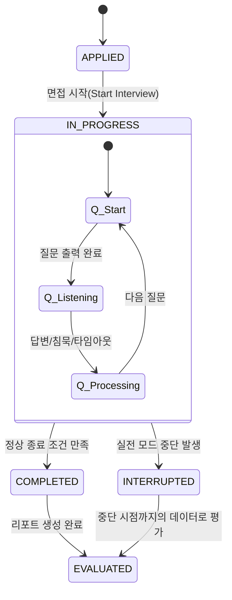

# TASK-017: Interview Session Engine (Plan Only)

본 문서는 실시간 면접 세션 엔진의 **동작 정책(Behavior Contract)**을 확정하는 문서이다.
이 문서는 제안 단계(Plan)이며, 승인 후 실제 구현의 기준(Spec)이 된다.

---

## 1. 세션 상태 전이 (State Machine)

면접 세션(`InterviewSession`)은 다음 5가지 상태를 가지며, 엄격한 전이 규칙을 따른다.

### 1.1 상태 정의 (Status Enum)

| 상태값 | 의미 | 비고 |
|---|---|---|
| **APPLIED** | 지원 완료 (면접 시작 전) | 초기 상태. 환경 체크 및 대기실 진입 가능 |
| **IN_PROGRESS** | 면접 진행 중 | 첫 번째 질문 시작 ~ 마지막 질문 종료 전 |
| **COMPLETED** | 정상 종료 | 모든 질문 완료 또는 조기 종료 조건 만족 |
| **INTERRUPTED** | 중단 종료 | 실전 모드에서 비정상 종료 시 확정되는 상태 |
| **EVALUATED** | 평가 완료 | 종료 후 비동기 평가/리포트 생성이 완료된 최종 상태 |

### 1.2 상태 전이 다이어그램 & 조건

### 1.3 모드별 중단(Interruption) 처리 정책

- **실전 모드 (Actual)**
  - 세션 연결 끊김 / 브라우저 종료 / 사용자 이탈 시 **즉시 또는 유예 시간 후 `INTERRUPTED` 상태로 확정**.
  - `INTERRUPTED` 상태에서는 `IN_PROGRESS`로 복귀 불가(재시도 불가).
  
- **연습 모드 (Practice)**
  - 중단(연결 끊김 등)이 발생해도 세션 상태는 유지되거나, 다시 접근 시 `IN_PROGRESS` 상태 내에서 처리한다.
  - 사용자가 다시 접속하면 **마지막 저장된 질문(Step)부터 재개(Resume) 허용**.
  - 별도의 "일시정지(Paused)" 상태값을 갖지 않으며, 로직 상 재진행을 허용하는 구조를 따른다.

---

## 2. 질문 전환 조건 (Transition Triggers)

하나의 질문(Step)은 다음 **3가지 트리거 중 하나**가 발생하면 즉시 종료되고 다음 단계로 넘어간다.

### 2.1 종료 트리거 우선순위

1. **답변 완료 버튼 클릭 (User Action)**
   - 가장 우선순위 높음.
   - 사용자가 답변을 마쳤음을 명시적으로 선언.
   
2. **질문당 제한시간 초과 (Time Limit)**
   - 공고별 설정(기본 2분).
   - 발화 중이라도 강제 종료.
   
3. **침묵 자동완료 (Silence Timeout)**
   - 공고별 설정(기본 10~15초).
   - **발화가 없는 상태**가 지속될 경우 자동 종료.

### 2.2 최소 질문 수 충족 전/후 동작

- **최소 질문 수 미달 시**:
  - 무응답이 연속되거나 답변이 짧아도, **강제로 다음 질문을 진행**한다.
  - 조기 종료는 불가능하다.
  
- **최소 질문 수 충족 후**:
  - 평가 계층(Evaluation Layer)이 반환한 **조기 종료 신호(Early Exit Signal)**가 존재할 경우에만 종료한다.

---

## 3. 최소 질문 수 정책 (Minimum Question Policy)

### 3.1 기준
- **기본값**: 10문항 (공고 설정에 따라 변경 가능)
- **계산 기준**: 완료된 질문 수(Completed Questions Count)
  - 질문이 사용자에게 제시되고, 위 2.1의 트리거 중 하나로 종료되면 **1회 수행**으로 인정.

### 3.2 무응답과 수행 완료
- **무응답(No Answer)**도 질문 수행으로 간주한다.
  - 예: 질문 출력 -> 15초 침묵 -> 자동 넘어감 => **1문항 수행 완료**.
  - 단, 평가는 평가 정책에 따라 페널티가 적용될 수 있다.

### 3.3 조기 종료 허용 조건
- 현재 질문 순번이 최소 질문 수를 충족해야만(`current >= min`) 조기 종료 로직이 동작한다.

---

## 4. 침묵(Silence) 2케이스 정책 (Strict Contract)

### 4.1 Case 1: 답변 후 침묵 (Post-Answer Silence)
- **상황**: 사용자가 유의미한 답변을 한 뒤, 완료 버튼을 안 누르고 가만히 있는 경우.
- **Session Engine 책임 (MUST)**:
  - 침묵 감지 시 반드시 **안내 메시지 이벤트(`SILENCE_WARNING`)를 발생**시켜야 한다.
  - 계속 침묵 유지 시 반드시 침묵 타임아웃 이벤트를 발생시켜야 한다.
- **Client 책임 (MUST)**:
  - `SILENCE_WARNING` 이벤트를 수신하면 반드시 사용자에게 **버튼 클릭을 유도하는 UI(Toast/Audio)를 노출**해야 한다.
- **데이터**: `is_no_answer = false`

### 4.2 Case 2: 무응답 침묵 (No-Answer Silence)
- **상황**: 질문 제시 후 **아무 말도 하지 않고** 침묵 유지.
- **처리**:
  1. 침묵 타임아웃 도달 시 즉시 다음 질문 진행.
- **데이터**: `is_no_answer = true`
- **평가**: 무응답 페널티 적용 대상.

### 4.3 평가 엔진 인터페이스
- 세션 엔진은 평가 요청 시 다음과 같은 상황 메타데이터를 전달해야 한다.
  - 침묵 유지 시간, 발화 감지 여부, 침묵에 의한 종료 여부

---

## 5. 종료 조건 범위 (Termination Scope)

세션은 다음 조건 중 하나라도 만족하면 `COMPLETED` 상태로 전이한다.

1. **총 질문 수 도달**
   - 현재 질문이 공고에 설정된 최대 질문 수에 도달한 경우.
   
2. **필수 질문 완료 & 조기 종료 만족**
   - 관리자가 지정한 필수 질문을 모두 수행했고,
   - AND 최소 질문 수를 충족했으며,
   - **AND 평가 계층(Evaluation Layer)으로부터 조기 종료 신호(Signal)를 수신한 경우.**

3. **세션 중단 (INTERRUPTED)**
   - 실전 모드에서 기술적/사용자 요인으로 중단된 경우.

---

## 6. 세션과 저장 계층의 관계 (Persistence)

### 6.1 상태 동기화 및 저장 시점

- **매 질문 종료 시 (Per Question)**:
  - `Redis` (Hot Memory): 최신 세션 상태(Current Step, History Buffer) 즉시 업데이트.
  
- **세션 종료 시 (End of Session)**:
  - `PostgreSQL` (Persistent Storage):
    - `interviews` 테이블 상태 업데이트.
    - `interview_evaluations` 및 `evaluation_scores` 테이블에 최종 확정 데이터 저장.

### 6.2 데이터 구분
- **Hot State (Redis)**:
  - 진행 중인 세션의 실시간 상태 및 임시 데이터.
- **Persistent Record (PostgreSQL)**:
  - 확정된 면접 결과 및 평가 데이터 영구 보관.

### 6.3 상태 업데이트 원칙
- `interviews.status`는 **상태 전이가 확정되는 즉시** 시스템에 반영한다.
- `IN_PROGRESS` -> `COMPLETED` / `INTERRUPTED` 전이는 데이터 정합성이 보장되어야 한다.

---
**주의**: 본 문서는 동작 계약(Contract)을 정의하며, 실제 구현 상세나 클래스 설계를 포함하지 않는다.
