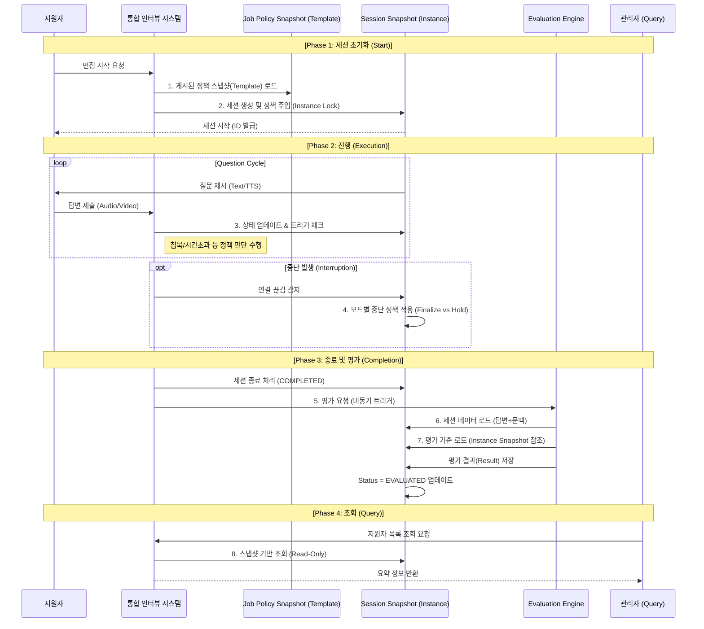

# TASK-021: End-to-End 인터뷰 실행 아키텍처 통합 설계 (Plan) - Final Locked

이 문서는 Phase 5의 최종 설계 문서로서, 개별 설계된 엔진과 정책들을 하나의 **통합된 실행 흐름(Unified Execution Flow)**으로 연결하는 아키텍처 및 데이터 계약(Data Contract)을 확정한다.

> **Note**: 본 문서에 포함된 다이어그램과 용어는 논리적 흐름과 책임을 정의하기 위한 것이며, 특정 구현 기술이나 물리적 계층 구조를 확정하지 않는다.

---

## 1. 목적 및 범위 (Purpose & Scope)

### 1.1 목적
- **통합 실행 무결성 보장**: Session, Job Policy, Evaluation 엔진 간의 데이터 흐름과 의존성을 명확히 하여, 실행 시점의 데이터 불변성을 보장한다.
- **상태 전이 계약 확정**: 면접 시작부터 종료, 평가까지 이어지는 단일 진실 공급원(Single Source of Truth)으로서의 상태 흐름을 정의한다.
- **모드별 동작 분리**: 실전(Actual)과 연습(Practice) 모드의 동작 차이를 아키텍처 수준에서 분리한다.

### 1.2 범위 (In-Scope)
- 전체 실행 흐름 (Start ~ End ~ Evaluation)
- Job Policy 게시 시점 및 Session 생성 시점의 데이터 스냅샷 전략
- Session Engine 상태 전이 테이블 (State Transition Table)
- Admin Query Layer의 데이터 접근 경계
- 실전/연습 모드별 실패 및 중단 복구 정책

### 1.3 비범위 (Out-of-Scope)
- 구현 레벨의 상세 설계 (클래스, 메서드, API 스펙)
- 물리적 데이터 저장소 구조 (테이블, 컬럼, 인덱스)
- 에러 핸들링의 세부 구현 로직
- 프론트엔드/UI 기획 및 디자인
- **관리자 개입에 의한 세션 초기화/복구 기능 (Reset)**: 이는 운영 정책 및 감사(Audit) 이슈와 결부되므로 본 Plan의 범위에서 제외하며, 추후 별도의 운영 기능으로 다룬다.

---

## 2. Root Integration Contract (핵심 통합 계약)

본 아키텍처는 다음의 **불변 계약(Immutable Contract)** 위에서 동작한다.

### [Contract 1: Job Policy Freeze at Publish]
1.  **게시 시점 고정**: 공고(Job Posting)가 `PUBLISHED` 상태로 전환되는 즉시, 해당 공고의 "AI 평가/진행 정책(Policy Schema)"은 불변 상태(Immutable)가 된다.
2.  **Immutable/Mutable 분리**: 공고 데이터는 수정 불가능한 **Immutable 영역**(평가 기준, 질문 구성, 시간 제한 등)과 수정 가능한 **Mutable 영역**(기간 연장, 오타 수정 등)으로 명확히 격리된다.
3.  **Snapshot 참조**: 이후 생성되는 모든 면접 세션(Interview Session)은 원본 공고가 아닌, 게시 시점에 고정된 **Job Policy Snapshot**을 기반으로 생성된다.
4.  **Single Source of Truth**: 이 Snapshot은 실행 엔진(Execution), 평가 엔진(Evaluation), 그리고 LLM에게 유일한 기준 정보(Truth)로 제공된다.
5.  **LLM 격리**: LLM 프롬프트 및 컨텍스트에는 오직 **Immutable Snapshot**만 전달되며, Mutable 영역의 변경 사항은 절대 주입되지 않는다.

---

## 3. End-to-End Interview Flow (논리적 흐름)

> **Note**: 본 다이어그램은 논리적 흐름을 설명하기 위한 것이며, 상태 전이는 Event-driven 또는 Command-driven 방식으로 구현될 수 있으나, 본 문서는 그 방식을 확정하지 않는다.

---

## 4. State Transition Contract (상태 전이 계약)

세션의 생명주기는 아래 정의된 상태와 전이만을 허용한다.

| 상태 (State) | 진입 조건 (Entry Condition) | 이탈 트리거 (Exit Trigger) | Final Type | 비고 |
| :--- | :--- | :--- | :--- | :--- |
| **APPLIED** | 지원 완료 시점 | `Start Interview` Action | - | 초기 상태 |
| **IN_PROGRESS** | `APPLIED` 상태에서 시작 요청 시 | `Complete Condition` Met   OR `Interruption` Event | - | 활성 상태 |
| **COMPLETED** | 모든 질문 완료 OR 조기 종료 조건 만족 | `Evaluation Start` Event | - | 진행 종료 (Pending Eval) |
| **INTERRUPTED** | `IN_PROGRESS` 중 비정상 중단 확정 시 | `Evaluation Start` Event (Actual)   OR `Resume` Action (Practice) | **Terminal Final** (Actual) Non-Final (Practice) | 실전은 여기서 인터랙션 종료 |
| **EVALUATED** | 평가 엔진이 점수/리포트 생성 완료 시 | 없음 (End of Lifecycle) | **Ultimate Final** | 모든 프로세스 완료 상태 |

> **Final Definition**:
> - **Terminal Final**: 사용자 인터랙션이 더 이상 불가능한 상태 (실전 모드 INTERRUPTED 포함).
> - **Ultimate Final**: 시스템 처리(평가 등)까지 모두 완료된 상태.

---

## 5. Snapshot Strategy (이중 잠금 전략)

데이터 무결성을 위해 두 단계의 스냅샷(Double Lock) 전략을 사용한다.

### 5.1 Level 1: Job Policy Snapshot (Template Contract)
- **생성 시점**: 공고 상태가 `DRAFT` → `PUBLISHED`로 변경되는 순간.
- **저장 대상**: AI 평가 기준, 질문 설정, 시간 제한 등 모든 "AI-Sensitive Fields".
- **성격**: **Template Contract**. 여러 세션이 공유하는 불변의 정책 원본.

### 5.2 Level 2: Session Config Snapshot (Instance Contract)
- **생성 시점**: 유저가 `APPLIED` → `IN_PROGRESS`로 진입하는(START) 순간.
- **저장 대상**: Level 1 Snapshot의 **Deep Copy**.
- **성격**: **Instance Contract**. 단일 세션에 귀속된 정책 사본.
- **목적**: 원본 공고 삭제 등의 사고로부터 개별 세션의 실행 환경을 완벽히 격리(Isolation)함.

---

## 6. Admin Query Boundary (조회 경계)

관리자 조회 시스템은 운영 데이터의 정합성을 해치지 않는 범위 내에서 동작한다.

1.  **Snapshot Access Only**: Admin Query는 실시간 데이터(Hot State)에 의존하지 않으며, 저장소에 확정된 스냅샷(Persistent State)만을 조회 대상으로 한다.
2.  **Read-Only Integrity**: 조회 계층은 세션의 상태나 데이터를 변경할 수 있는 **어떠한 권한도 갖지 않는다**.
3.  **DTO Isolation**: 시스템 내부의 상태 객체나 도메인 엔티티를 그대로 노출하지 않으며, 조회 전용 DTO로 변환하여 반환한다.
4.  **Truth Preservation**: 엔진이 기록한 `Status Enum` 값을 그대로 존중하며, 임의로 해석하여 상태를 변조하거나 숨기지 않는다.

---

## 7. Failure / Recovery Policy (중단 및 복구 정책)

시스템 장애나 사용자 이탈 시의 대응 정책을 모드별 핵심 가치에 따라 분리한다.

### 7.1 실전 모드 (Actual Mode) - Fairness & Consistency
- **핵심 가치**: 공정성과 일관성 우선.
- **정책**: **No-Retry (재진입 불가)**.
- **사용자 이탈**: 네트워크 단절 등 감지 시, 유예 시간 없이(또는 최소화하여) `INTERRUPTED`로 상태를 확정(Finalize)한다.
- **예외 처리**: 천재지변 등에 의한 중단도 시스템적으로는 `INTERRUPTED` 처리하며, 운영 차원의 별도 소명 절차(Out-of-Scope)로 이관한다.

### 7.2 연습 모드 (Practice Mode) - UX & Learning Experience
- **핵심 가치**: 사용자 경험 및 학습 기회 제공 우선.
- **정책**: **Retry-Allowed (재진입 허용)**.
- **사용자 이탈**: 이탈 시 상태를 유지하거나, 재접속 시 마지막으로 완료된 질문(Step)의 다음 단계부터 **이어하기(Resume)**를 허용한다.

---

## 8. Open Decision Points (정책 결정 필요 항목)

현재 아키텍처에서 기술적으로 확정하지 않고, 비즈니스/운영 정책 결정에 따라 유연하게 구성해야 할 영역이다.

### 8.1 중단된 세션의 평가 여부 (Evaluation on Interruption)
- `INTERRUPTED` 상태의 세션을 어떻게 처리할 것인가에 대한 정책 결정이 필요하다.
- **Option A (평가 수행)**: 진행된 문항까지만 부분 점수를 산출하여 `EVALUATED`로 전이 (Default).
- **Option B (평가 제외)**: 중단된 세션은 평가하지 않고 `INTERRUPTED` 상태로 영구 보존.

### 8.2 완료 후 평가 트리거 시점 (Trigger Timing)
- `COMPLETED` 즉시 평가를 시작할 것인가(Real-time), 아니면 배치(Batch)로 처리할 것인가?
- **Default Plan**: 사용자 경험(빠른 리포트)을 위해 즉시 트리거(Event-Driven)를 기본으로 한다.

---

## 9. Conclusion

본 문서는 TASK-021의 결과물로서, **"공고 게시 시점의 불변 정책을 기준으로, 세션 실행, 평가, 조회까지 이어지는 End-to-End 인터뷰 시스템의 단일 기준(Baseline)"**을 정의한다.
이 설계는 이후 구현 단계(Phase 6)에서 변경 없이 준수되어야 할 최상위 기준이 된다.
