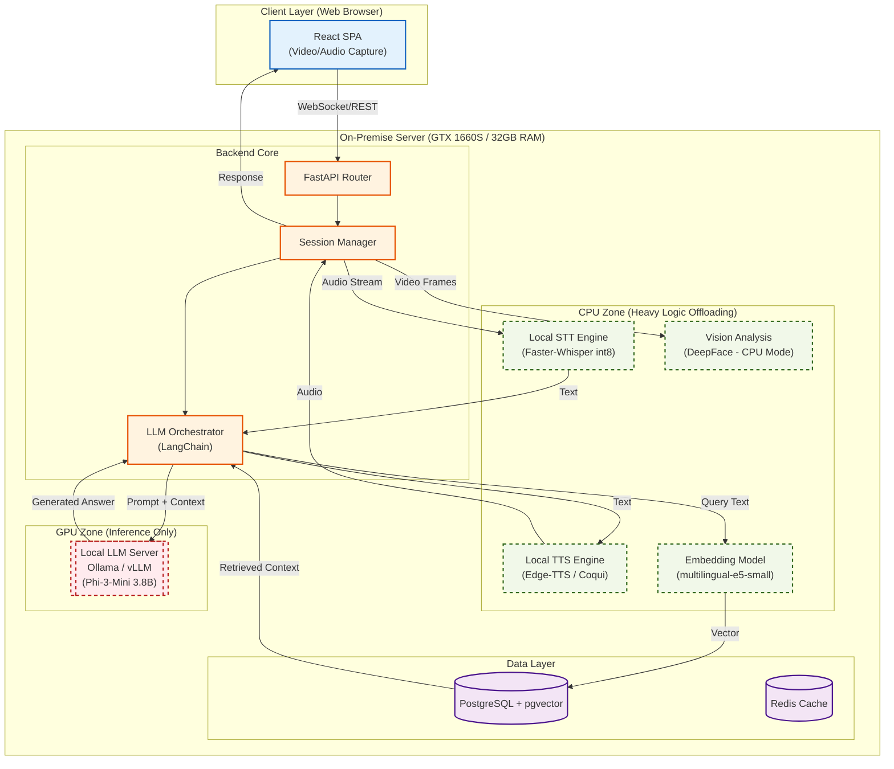

```mermaid
graph TD
    %% 스타일 정의
    classDef client fill:#e3f2fd,stroke:#1565c0,stroke-width:2px;
    classDef backend fill:#fff3e0,stroke:#e65100,stroke-width:2px;
    classDef cpuZone fill:#f1f8e9,stroke:#33691e,stroke-width:2px,stroke-dasharray: 5 5;
    classDef gpuZone fill:#ffebee,stroke:#b71c1c,stroke-width:2px,stroke-dasharray: 5 5;
    classDef db fill:#f3e5f5,stroke:#4a148c,stroke-width:2px;

    %% 1. 클라이언트 영역
    subgraph "Client Layer (Web Browser)"
        FE["React SPA<br/>(Video/Audio Capture)"]
    end

    %% 2. 온프레미스 서버 영역
    subgraph "On-Premise Server (GTX 1660S / 32GB RAM)"
        
        %% 백엔드 코어
        subgraph "Backend Core"
            API[FastAPI Router]
            Session[Session Manager]
            Orch["LLM Orchestrator<br/>(LangChain)"]
        end

        %% CPU 존 (RAM 32GB 활용)
        subgraph "CPU Zone (Heavy Logic Offloading)"
            direction TB
            STT["Local STT Engine<br/>(Faster-Whisper int8)"]
            TTS["Local TTS Engine<br/>(Edge-TTS / Coqui)"]
            Vision["Vision Analysis<br/>(DeepFace - CPU Mode)"]
            Embed["Embedding Model<br/>(multilingual-e5-small)"]
        end

        %% GPU 존 (VRAM 6GB 올인)
        subgraph "GPU Zone (Inference Only)"
            LLM[["Local LLM Server<br/>Ollama / vLLM<br/>(Phi-3-Mini 3.8B)"]]
        end

        %% 데이터베이스 존
        subgraph "Data Layer"
            PG[(PostgreSQL + pgvector)]
            Redis[(Redis Cache)]
        end
    end

    %% 연결 관계
    FE -->|WebSocket/REST| API
    API --> Session
    Session --> Orch

    %% 오디오/비디오 처리 흐름
    Session -->|Audio Stream| STT
    STT -->|Text| Orch
    Session -->|Video Frames| Vision
    
    %% RAG 흐름 (핵심 변경 포인트)
    Orch -->|Query Text| Embed
    Embed -->|Vector| PG
    PG -->|Retrieved Context| Orch
    
    %% LLM 추론 흐름
    Orch -->|Prompt + Context| LLM
    LLM -->|Generated Answer| Orch
    
    %% 답변 출력 흐름
    Orch -->|Text| TTS
    TTS -->|Audio| Session
    Session -->|Response| FE

    %% 스타일 적용
    class FE client;
    class API,Session,Orch backend;
    class STT,TTS,Vision,Embed cpuZone;
    class LLM gpuZone;
    class PG,Redis db;
```