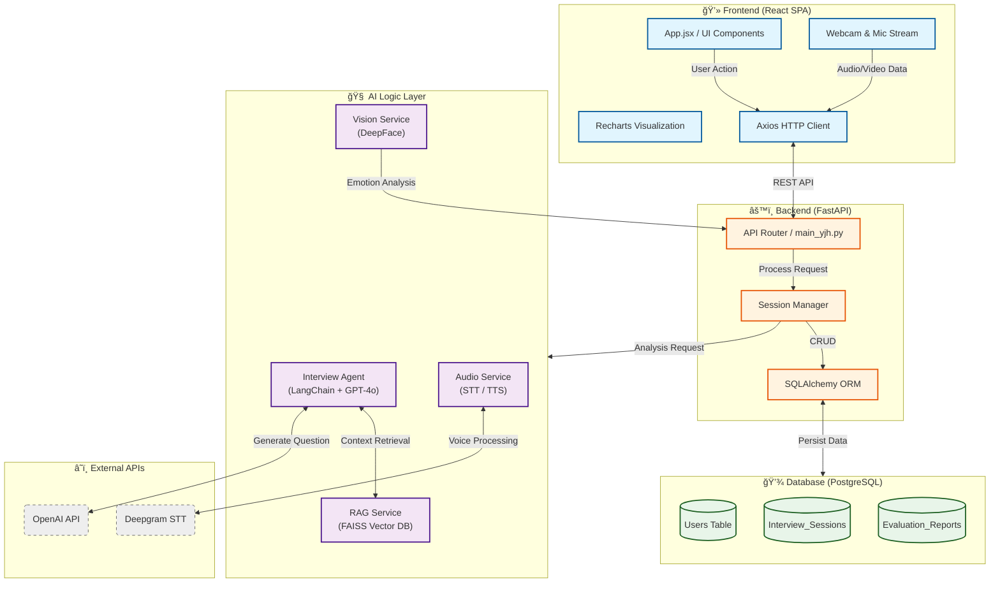

```mermaid
graph TD
    %% ìŠ¤íƒ€ì¼ ì •ì˜ (그대로 유지)
    classDef client fill:#e1f5fe,stroke:#01579b,stroke-width:2px;
    classDef server fill:#fff3e0,stroke:#e65100,stroke-width:2px;
    classDef ai fill:#f3e5f5,stroke:#4a148c,stroke-width:2px;
    classDef db fill:#e8f5e9,stroke:#1b5e20,stroke-width:2px;
    classDef ext fill:#eeeeee,stroke:#616161,stroke-dasharray: 5 5;

    %% [수정ë¨] ì œëª©ì— ë”°ì˜´í‘œ("") 추가
    subgraph User_Client ["💻 Frontend (React SPA)"]
        direction TB
        UI[App.jsx / UI Components]:::client
        Media[Webcam & Mic Stream]:::client
        Chart[Recharts Visualization]:::client
        Axios[Axios HTTP Client]:::client
    end

    subgraph Backend_Server ["âš™ï¸ Backend (FastAPI)"]
        direction TB
        Router[API Router / main_yjh.py]:::server
        Session[Session Manager]:::server
        ORM[SQLAlchemy ORM]:::server
    end

    subgraph AI_Services ["🧠 AI Logic Layer"]
        direction TB
        Agent["Interview Agent <br/>(LangChain + GPT-4o)"]:::ai
        RAG["RAG Service <br/>(FAISS Vector DB)"]:::ai
        Vision["Vision Service <br/>(DeepFace)"]:::ai
        Audio["Audio Service <br/>(STT / TTS)"]:::ai
    end

    subgraph Data_Storage ["💾 Database (PostgreSQL)"]
        direction TB
        DB_User[("Users Table")]:::db
        DB_Session[("Interview_Sessions")]:::db
        DB_Report[("Evaluation_Reports")]:::db
    end

    subgraph External_APIs ["â˜ï¸ External APIs"]
        OpenAI(OpenAI API)
        Deepgram(Deepgram STT)
    end

    %% ì—°ê²°ì„  ì •ì˜
    UI -->|User Action| Axios
    Media -->|Audio/Video Data| Axios
    Axios <-->|REST API| Router

    Router -->|Process Request| Session
    Session -->|Analysis Request| AI_Services
    
    Agent <-->|Context Retrieval| RAG
    Agent <-->|Generate Question| OpenAI
    Vision -->|Emotion Analysis| Router
    Audio <-->|Voice Processing| Deepgram
    
    Session -->|CRUD| ORM
    ORM <-->|Persist Data| Data_Storage

    %% 외부 API ìŠ¤íƒ€ì¼ ì ìš©
    class OpenAI,Deepgram ext;
```