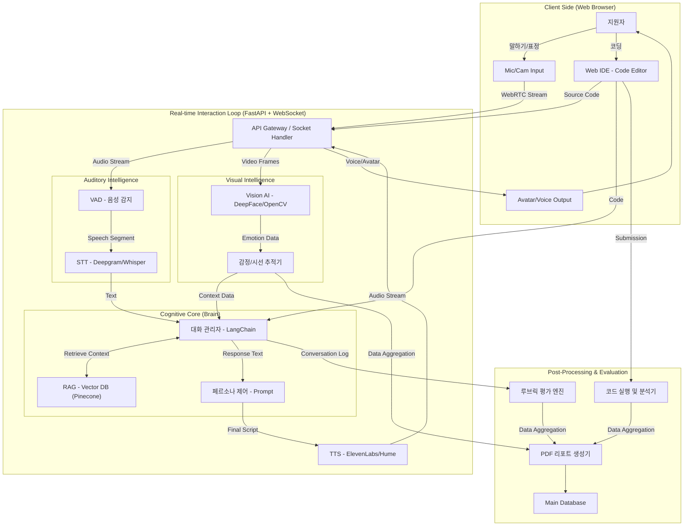

```mermaid
graph TD
    %% 사용자 및 클라이언트 영역
    subgraph "Client Side (Web Browser)"
        Candidate["지원자"]
        AV_Input["Mic/Cam Input"]
        Code_Input["Web IDE - Code Editor"]
        UI_Feedback["Avatar/Voice Output"]
    end

    %% 실시간 처리 루프 (The Loop)
    subgraph "Real-time Interaction Loop (FastAPI + WebSocket)"
        Gateway["API Gateway / Socket Handler"]
        
        %% 청각/언어 처리
        subgraph "Auditory Intelligence"
            VAD["VAD - 음성 감지"]
            STT["STT - Deepgram/Whisper"]
        end
        
        %% 시각 처리
        subgraph "Visual Intelligence"
            Vision["Vision AI - DeepFace/OpenCV"]
            Emotion_Tracker["감정/시선 추적기"]
        end

        %% 두뇌
        subgraph "Cognitive Core (Brain)"
            Orchestrator["대화 관리자 - LangChain"]
            Persona["페르소나 제어 - Prompt"]
            RAG["RAG - Vector DB (Pinecone)"]
        end

        %% 발화
        TTS["TTS - ElevenLabs/Hume"]
    end

    %% 비동기 분석 및 저장
    subgraph "Post-Processing & Evaluation"
        Rubric_Eval["루브릭 평가 엔진"]
        Code_Eval["코드 실행 및 분석기"]
        Report_Gen["PDF 리포트 생성기"]
        DB["Main Database"]
    end

    %% 데이터 흐름 연결
    Candidate --> |말하기/표정| AV_Input
    Candidate --> |코딩| Code_Input
    
    AV_Input --> |WebRTC Stream| Gateway
    Code_Input --> |Source Code| Gateway

    Gateway --> |Audio Stream| VAD
    VAD --> |Speech Segment| STT
    Gateway --> |Video Frames| Vision
    Vision --> |Emotion Data| Emotion_Tracker

    STT --> |Text| Orchestrator
    Emotion_Tracker --> |Context Data| Orchestrator
    Code_Input --> |Code| Orchestrator
    
    Orchestrator <--> |Retrieve Context| RAG
    Orchestrator --> |Response Text| Persona
    Persona --> |Final Script| TTS
    
    TTS --> |Audio Stream| Gateway
    Gateway --> |Voice/Avatar| UI_Feedback
    UI_Feedback --> Candidate

    %% 평가 흐름
    Orchestrator --> |Conversation Log| Rubric_Eval
    Code_Input --> |Submission| Code_Eval
    Rubric_Eval & Code_Eval & Emotion_Tracker --> |Data Aggregation| Report_Gen
    Report_Gen --> DB
```