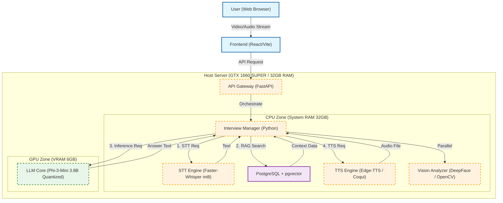

# On-Premise Architecture

본 문서는 로컬 환경(GTX 1660 SUPER / 32GB RAM)에서의 AI 면접 시뮬레이션 시스템 아키텍처를 설명합니다.

## Architecture Overview

이 시스템은 리소스가 제한된 온프레미스 환경에서 효율적인 실시간 처리를 위해 CPU와 GPU 부하를 분산하도록 설계되었습니다.

## System Components

### 1. Client & Gateway
- **Frontend (React/Vite)**: 사용자의 영상 및 음성 스트림을 캡처하여 서버로 전달합니다.
- **API Gateway (FastAPI)**: 모든 요청의 진입점이며 실시간 통신을 조율합니다.

### 2. CPU Zone (Operations)
- **STT Engine**: `Faster-Whisper`를 `int8` 양자화하여 CPU에서도 빠른 음성 인식을 수행합니다.
- **Vision Analyzer**: `DeepFace`와 `OpenCV`를 활용하여 면접자의 표정과 시선을 분석합니다.
- **RAG & VectorDB**: `PostgreSQL`과 `pgvector`를 사용하여 관련 지식을 검색합니다.
- **TTS Engine**: `Edge-TTS` 또는 `Coqui`를 사용하여 자연스러운 음성을 생성합니다.

### 3. GPU Zone (Cognitive Core)
- **LLM Core**: 6GB의 VRAM 환경을 고려하여 `Phi-3-Mini (3.8B)` 모델을 양자화하여 탑재했습니다. 면접관의 페르소나를 유지하며 답변을 생성합니다.