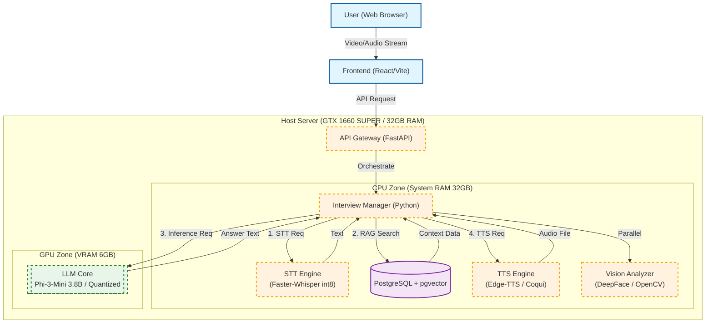

```mermaid
graph TD
    %% 스타일 정의
    classDef client fill:#e1f5fe,stroke:#01579b,stroke-width:2px;
    classDef cpuZone fill:#fff3e0,stroke:#ff9800,stroke-width:2px,stroke-dasharray: 5 5;
    classDef gpuZone fill:#e8f5e9,stroke:#2e7d32,stroke-width:2px,stroke-dasharray: 5 5;
    classDef db fill:#f3e5f5,stroke:#7b1fa2,stroke-width:2px;

    User["User (Web Browser)"] -->|Video/Audio Stream| FE["Frontend (React/Vite)"]
    FE -->|API Request| Gateway["API Gateway (FastAPI)"]
    
    subgraph "Host Server (GTX 1660 SUPER / 32GB RAM)"
        
        Gateway -->|Orchestrate| Manager["Interview Manager (Python)"]

        subgraph "CPU Zone (System RAM 32GB)"
            direction TB
            Manager -->|1. STT Req| STT["STT Engine<br/>(Faster-Whisper int8)"]
            Manager -->|2. RAG Search| VectorDB[("PostgreSQL + pgvector")]
            Manager -->|4. TTS Req| TTS["TTS Engine<br/>(Edge-TTS / Coqui)"]
            Manager -->|Parallel| Vision["Vision Analyzer<br/>(DeepFace / OpenCV)"]
        end

        subgraph "GPU Zone (VRAM 6GB)"
            direction TB
            LLM_Model[["LLM Core<br/>Phi-3-Mini 3.8B / Quantized"]]
            Manager -->|3. Inference Req| LLM_Model
        end

    end

    STT -->|Text| Manager
    VectorDB -->|Context Data| Manager
    LLM_Model -->|Answer Text| Manager
    TTS -->|Audio File| Manager
    
    class User,FE client;
    class STT,TTS,Vision,Manager,Gateway cpuZone;
    class LLM_Model gpuZone;
    class VectorDB db;
```