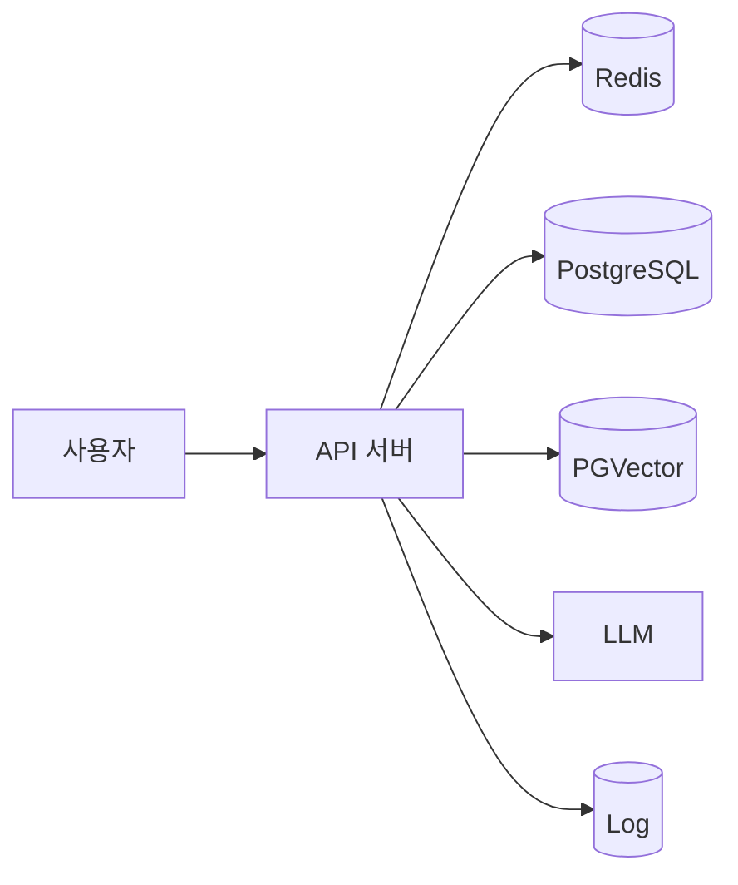
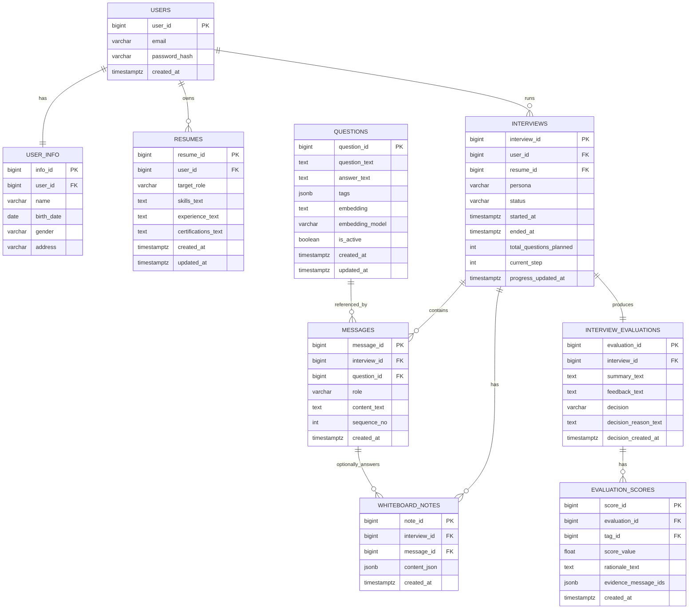
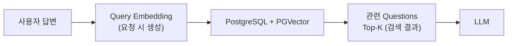
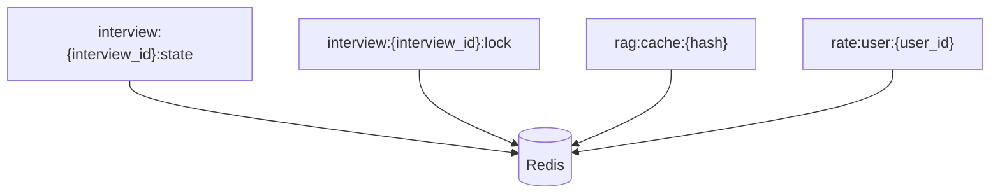
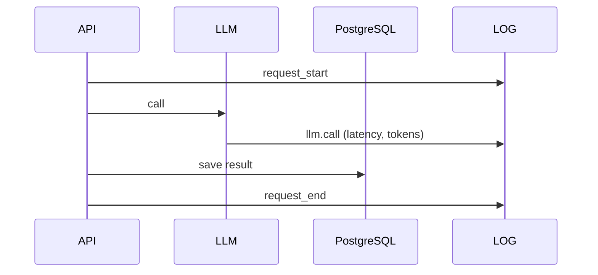

# AI 면접 시스템 데이터 설계 종합 문서

> 이 문서는 **AI 면접 시스템을 처음 개발하는 팀**을 기준으로 작성되었습니다.  
> “이 데이터가 왜 필요한지”, “어디에 저장해야 하는지”, “컬럼 하나하나가 무엇을 의미하는지”를  
> **PostgreSQL / PGVector / Redis / Log** 관점에서 분리하여 설명합니다.

---

# 0. 전체 개요 (먼저 큰 그림)

우리 시스템에서 데이터는 **4가지 저장소 역할**로 나뉩니다.

| 구분 | 저장소 | 역할 요약 |
|---|---|---|
| ① 정답 데이터 | PostgreSQL | 서비스의 결과물(절대 잃으면 안 됨) |
| ② 검색용 벡터 | PGVector | 질문/RAG 검색을 위한 임베딩 |
| ③ 임시 데이터 | Redis | 빠른 상태/캐시/락 (날아가도 PostgreSQL의 데이터를 기반으로 복구 가능) |
| ④ 추적 기록 | Log | 나중에 문제 원인 분석용 기록 |

> 핵심 원칙  
> - **PostgreSQL = 결과**  
> - **Redis = 과정**  
> - **Log = 흔적**  
> - **PGVector = 검색 인덱스**

---

## 전체 데이터 흐름 개요



### 이 그림 하나로 알 수 있는 것
- PostgreSQL은 **면접 결과를 저장**
- Redis는 **실시간 상태와 캐시 관리**
- PGVector는 **LLM을 위한 검색 참고**
- Log는 **모든 요청의 흔적 기록**
- LLM은 **저장소가 아닌 계산 주체**

# 1. PostgreSQL (관계형 DB, ERD 대상)

PostgreSQL에는 **사용자에게 다시 보여줘야 하거나,
평가/감사 기준이 되는 확정 데이터**만 저장합니다.

- 면접 기록, 점수, 피드백은 서비스의 **정답 데이터**
- Redis나 로그에 저장하면 **유실/정합성 문제**가 발생할 수 있음

---

## 1-0. PostgreSQL ERD 전체



---

## 1-1. users (계정 정보)

| 컬럼 | 타입 | 설명 |
|---|---|---|
| user_id | bigint PK | 사용자 고유 ID |
| email | varchar | 로그인에 사용하는 이메일 |
| password_hash | varchar | 비밀번호 해시값 (절대 평문 저장 금지) |
| created_at | timestamptz | 회원 가입 시각 |

> 로그인과 데이터 소유권 판단의 기준 테이블입니다.

---

## 1-2. user_info (개인 정보 – 분리 보관)

> 기존 `user_pii` → **`user_info`**  
> `user_info.user_id`는 **UNIQUE**로 설정하여 사용자당 1행만 존재합니다.

| 컬럼 | 타입 | 설명 |
|---|---|---|
| info_id | bigint PK | 개인정보 테이블 PK |
| user_id | bigint FK | users.user_id (1:1 관계) |
| name | varchar | 실명 |
| birth_date | date | 생년월일 |
| gender | varchar | 성별 |
| address | varchar | 주소 |

> 개인정보는 별도 테이블로 분리하여 접근 제어와 삭제 요청 대응을 쉽게 합니다.

---

## 1-3. resumes (이력서 / 프로필)

| 컬럼 | 타입 | 설명 |
|---|---|---|
| resume_id | bigint PK | 이력서 ID |
| user_id | bigint FK | 소유 사용자 |
| target_role | varchar | 지원 직무 |
| skills_text | text | 기술 스택 |
| experience_text | text | 경력 요약 |
| certifications_text | text | 자격증 |
| created_at | timestamptz | 생성 시각 |
| updated_at | timestamptz | 수정 시각 |

> 질문 생성과 평가에 사용되는 **입력 데이터**입니다.

---

## 1-4. interviews (면접 세션)

| 컬럼 | 타입 | 설명 |
|---|---|---|
| interview_id | bigint PK | 면접 ID |
| user_id | bigint FK | 면접자 |
| resume_id | bigint FK | 사용된 이력서 |
| persona | varchar | 면접관 성향 |
| status | varchar | running / completed |
| started_at | timestamptz | 시작 시각 |
| ended_at | timestamptz | 종료 시각 |
| total_questions_planned | int | 계획된 질문 수 |
| current_step | int | 현재 질문 번호 |
| progress_updated_at | timestamptz | current_step 변경 시 갱신 시각 |

---

## 1-5. messages (면접 대화 기록)

| 컬럼 | 타입 | 설명 |
|---|---|---|
| message_id | bigint PK | 메시지 ID |
| interview_id | bigint FK | 소속 면접 |
| question_id | bigint FK (NULL 가능) | **questions.question_id** (질문 자산에서 가져온 질문이면 연결) |
| role | varchar | question / answer / system |
| content_text | text | 최종 확정 텍스트 |
| sequence_no | int | 대화 순서 |
| created_at | timestamptz | 생성 시각 |

> 면접의 핵심 기록이며, 최종 확정 텍스트는 반드시 PostgreSQL에 저장합니다.  
> `question_id`는 질문 자산(`questions`)에서 가져온 질문을 추적하기 위한 옵션이며, 생성형 질문은 NULL일 수 있습니다.

---

## 1-6. interview_evaluations (면접 총평)

| 컬럼 | 타입 | 설명 |
|---|---|---|
| evaluation_id | bigint PK | 평가 ID |
| interview_id | bigint FK | 면접 ID (UNIQUE) |
| summary_text | text | 요약 |
| feedback_text | text | 종합 피드백 |
| decision | varchar | pass / fail |
| decision_reason_text | text | 합불 사유 |
| decision_created_at | timestamptz | 결정 시각 |

> `pass_fail_decisions` 테이블을 흡수한 결과입니다.

---

## 1-7. evaluation_scores (루브릭 점수)

| 컬럼 | 타입 | 설명 |
|---|---|---|
| score_id | bigint PK | 점수 ID |
| evaluation_id | bigint FK | 평가 |
| tag_id | bigint FK | 루브릭 태그 |
| score_value | float | 점수 |
| rationale_text | text | 점수 이유 |
| evidence_message_ids | jsonb | 근거 메시지 ID 목록 |
| created_at | timestamptz | 생성 시각 |
> `tag_id`는 루브릭 태그 마스터(예: rubric_tags)를 참조하기 위한 컬럼이며,
> 태그 마스터 테이블은 MVP 범위에 따라 옵션으로 추가될 수 있습니다.

---
## 1-8. questions (질문/답변/태그/벡터 통합 – RAG용 추가사항)

| 컬럼 | 타입 | 설명 |
|---|---|---|
| question_id | bigint PK | QA 데이터 ID |
| question_text | text | 질문 원문 |
| answer_text | text | 참고/모범 답변 (없으면 NULL 가능) |
| tags | jsonb | 태그 배열(직무/기술/평가의도 등) 예: ["system_design","backend"] |
| embedding | vector | RAG 검색용 임베딩 벡터(pgvector) |
| embedding_model | varchar | 임베딩 생성 모델 식별자(모델 변경 대비) |
| is_active | boolean | 사용 여부 |
| created_at | timestamptz | 생성 시각 |
| updated_at | timestamptz | 수정 시각 |

> 질문뱅크 + 답변예시 + 태그 + 임베딩을 **단일 테이블로 관리**합니다.  
> RAG 검색은 `embedding` 벡터를 대상으로 수행하며, 면접 중 사용된 질문은 `messages.question_id`로 추적할 수 있습니다(옵션).

---
## 1-9. whiteboard_notes (화이트보드 답변)

| 컬럼 | 타입 | 설명 |
|---|---|---|
| note_id | bigint PK | 화이트보드 답변 ID |
| interview_id | bigint FK | 소속 면접 |
| message_id | bigint FK (NULL 가능) | 연결된 질문 메시지 |
| content_json | jsonb | 드로잉 데이터(stroke, shape 등) |
| created_at | timestamptz | 제출 시각 |

> 화이트보드 답변은  
> “구조 설계도를 그려라” 유형 질문에 대한 **정식 답변 데이터**입니다.  
> 텍스트 답변(`messages`)과 동일한 평가 대상입니다.
> message_id는 특정 질문에 대한 답변으로 연결될 때만 사용하며, 독립 과제/테스트 저장의 경우 NULL일 수 있습니다.
---
# 2. PGVector (RAG / 검색 전용)

PGVector는 **PostgreSQL 내부 확장(extension)** 으로 동작합니다.  
즉, 별도의 벡터 DB가 아니라 **PostgreSQL 테이블 안에 vector 타입 컬럼을 추가**하여
의미 기반 검색(RAG)을 가능하게 합니다.

> 이 단계의 핵심 목적  
> - LLM이 **질문 생성·평가 시 참고할 지식**을 빠르게 찾게 한다  
> - 검색 결과는 **정답 데이터가 아닌 참고 자료**이다

---

## 2-0. RAG 전체 흐름 시각화



### 이 그림에서 중요한 포인트
- **Query Embedding(QE)** 은 요청 시 생성되며 **DB에 저장하지 않는다**
- PGVector는 검색만 담당하고, **결과를 저장하지 않는다**
- 기본 검색 대상은 `questions.embedding`이며, 결과는 `questions.question_text/answer_text/tags`로 반환된다
- 검색된 결과(questions)는 LLM 입력에만 사용된다

---

## 2-1. (옵션) kb_documents (지식 원문 저장소)

- `kb` = **Knowledge Base(지식 저장소)**
- LLM이 참고할 수 있는 **직무 설명, 가이드, 평가 기준** 등의 원문을 저장하는 *확장 옵션*입니다.
- 단, 현재 설계의 기본은 `questions` 테이블에 원문+임베딩을 함께 두는 방식이며, 이 테이블은 *문서형 지식 확장 시에만* 사용합니다.

| 컬럼 | 타입 | 설명 |
|---|---|---|
| doc_id | bigint PK | 문서 고유 ID |
| source_type | varchar | 원본 종류 (questions / job_profile / rubric_guide 등) |
| source_id | bigint | 원본 테이블의 PK 값 |
| content_text | text | 문서 전체 원문 |
| created_at | timestamptz | 문서 생성 시각 |

### source_type / source_id 예시
- `source_type = "questions"` → `source_id = questions.question_id`
- `source_type = "job_profile"` → `source_id = job_profiles.job_id`
- `source_type = "rubric_guide"` → `source_id = rubric_guides.guide_id`

> source_type과 source_id는 **실제 FK 제약을 걸지 않고**,  
> 지식의 출처를 논리적으로 추적하기 위한 용도입니다.

---

## 2-2. (옵션) kb_chunks (검색 단위 + 임베딩 저장)

- 긴 문서를 그대로 검색하지 않고, **의미 단위로 잘게 나눈 조각(chunk)** 을 검색 대상으로 사용합니다.
- (옵션) 문서형 지식을 chunking 하는 경우, 실제 벡터 검색은 이 테이블을 기준으로 이루어집니다.

| 컬럼 | 타입 | 설명 |
|---|---|---|
| chunk_id | bigint PK | 청크 ID |
| doc_id | bigint FK | kb_documents.doc_id |
| chunk_text | text | 분할된 텍스트 조각 |
| embedding | vector(N) | 임베딩 벡터 (모델 차원 고정) |
| metadata | jsonb | 청크 순서, 출처, 섹션명, 태그 등 |

> 검색 대상은 **문서(documents)** 가 아니라 **청크(chunks)** 단위입니다.

### 초보자 참고: vector(N)이란?
- 임베딩 모델마다 출력 차원(N)이 고정되어 있습니다.
- 예: 768 / 1024 / 1536 차원
- 따라서 embedding 컬럼은 `vector(768)`처럼 **고정 차원으로 정의**합니다.

---

## 2-3. PGVector 사용 원칙 요약

- PGVector는 **정답 데이터를 저장하지 않는다**
- 검색 결과는 **LLM 입력에만 사용**한다
- Query Embedding은 **저장하지 않는다**
- kb_documents는 원본, kb_chunks는 검색용이다

---

---

# 3. Redis (임시 데이터 / 캐시)

Redis는 **관계형 DB가 아니며 테이블 개념이 없습니다.**  
따라서 ERD가 아니라 **Key-Value 규약(Key Map)** 으로 문서화합니다.

> Redis에 저장되는 데이터의 공통 특징  
> - 전부 **임시 데이터**
> - 대부분 **TTL(만료 시간)** 이 설정됨  
> - Redis 장애로 데이터가 사라져도 **PostgreSQL의 정답 데이터로 복구 가능**해야 함

---

## 3-1. Redis Key Map (시각화)



이 다이어그램은 **Redis에 어떤 종류의 키들이 존재하는지**를 한눈에 보여줍니다.

---

## 3-2. Redis Key 규약 상세

| Key 패턴 | 타입 | 저장 내용 | TTL |
|---|---|---|---|
| interview:{interview_id}:state | hash | 면접 진행 상태 | 10분 |
| interview:{interview_id}:lock | string | 중복 실행 방지용 락 | 30초 |
| rag:cache:{hash} | string | RAG 검색 결과 캐시 | 1시간 |
| rate:user:{user_id} | counter | 사용자 요청 횟수 | 1분 |

---

## 3-3. 각 Key의 역할 상세 설명

### 3-3-1 interview:{interview_id}:state
- **타입**: hash
- **역할**: 면접이 진행 중일 때의 실시간 상태 저장
- **예시 필드**
  - current_step: 현재 질문 번호
  - current_question_id: 현재 질문 ID (questions.question_id)
  - last_activity_at: 마지막 사용자 응답 시각

> 이 데이터는 면접 도중 매우 자주 변경되므로 PostgreSQL이 아닌 Redis가 적합합니다.

---

### 3-3-2 interview:{interview_id}:lock
- **타입**: string
- **역할**: 동일 면접 세션에서 LLM 호출이 중복 실행되는 것을 방지
- **동작 방식**
  - LLM 호출 전: lock 설정 (SET NX)
  - 호출 종료 후: lock 해제 또는 TTL 만료

> 락이 풀리지 않더라도 TTL로 자동 해제되어 시스템이 멈추지 않습니다.

---

### 3-3-3 rag:cache:{hash}
- **타입**: string
- **역할**: 동일한 RAG 검색 요청 결과 재사용
- **hash 구성 예시**
  - 질문 텍스트
  - 직무 ID
  - 최근 대화 요약

> 캐시를 사용하면 **대화가 길어질수록 느려지는 문제를 완화**할 수 있습니다.

---

### 3-3-4 rate:user:{user_id}
- **타입**: counter
- **역할**: 사용자 요청 빈도 제한 (Rate Limit)
- **용도**
  - 악의적 요청 방지
  - 서버 과부하 방지

---

## 3-4. Redis 사용 원칙 (초보자용 요약)

- Redis에는 **결과 데이터(면접 기록, 점수, 피드백)를 저장하지 않는다**
- Redis 데이터는 언제든 사라질 수 있다고 가정한다
- 모든 Redis 데이터는 **PostgreSQL을 기준으로 복구 가능해야 한다**
- TTL이 없는 Redis 키는 거의 사용하지 않는다

---

# 4. Log (로그 / 관측 데이터)

로그는 **비즈니스 데이터 저장소가 아닙니다.**  
기능을 위해 조회하는 데이터가 아니라, **문제 원인을 추적하기 위한 시간 순서 기록**입니다.

> 로그의 목적  
> - 시스템이 *언제* 무엇을 했는지 남긴다  
> - 장애/지연/오작동을 **사후에 재현**할 수 있게 한다  
> - PostgreSQL / Redis / LLM 어느 쪽 문제인지 구분할 수 있게 한다

---

## 4-1. 로그 흐름 시각화



> 이 시퀀스는 **요청 1건(request_id 기준)** 이 어떻게 흘러가는지를 보여줍니다.

---

## 4-2. 반드시 남겨야 할 공통 필드

아래 필드는 **모든 로그 이벤트에 공통으로 포함**되어야 합니다.

| 필드 | 설명 |
|---|---|
| timestamp | 로그 발생 시각 |
| level | 로그 레벨 (INFO / WARN / ERROR) |
| request_id | 하나의 요청을 묶는 추적 ID |
| user_id | 요청 사용자 (비로그인 요청이면 null) |
| interview_id | 면접 ID (면접 외 요청이면 null) |
| latency_ms | 해당 단계 처리 시간 |
| status | 성공/실패 여부 또는 상태 코드 |

> `request_id`를 기준으로 **한 요청의 모든 로그를 묶어 추적**할 수 있어야 합니다.

---

## 4-3. LLM 로그 예시 (표준 형태)

```json
{
  "timestamp": "2026-02-05T14:32:10.123Z",
  "level": "INFO",
  "event": "llm.call",
  "model": "qwen-4b",
  "tokens_in": 1200,
  "tokens_out": 300,
  "latency_ms": 842,
  "request_id": "abc-123",
  "interview_id": 42,
  "status": "success"
}
```

> 이 로그 하나로 아래를 알 수 있습니다.  
> - 어떤 모델을 썼는지  
> - 토큰 사용량이 얼마나 늘었는지  
> - 어느 요청이 느렸는지  

---

## 4-4. 로그에 절대 남기면 안 되는 것

아래 항목은 **보안/법적 문제**를 일으킬 수 있으므로 로그에 남기지 않습니다.

- 사용자 답변 원문 (텍스트 / 화이트보드 원본 포함)
- 프롬프트 전체 텍스트
- 개인정보(user_info 내용)
- 토큰 / 비밀번호 / 인증 헤더

- 음성 인식(STT)을 사용하는 경우에도, 면접 결과로 확정된 대화 텍스트만 `messages` 테이블에 저장한다.
- STT 처리 과정에서 생성되는 중간 결과(원문 출력, 정규화 과정, 신뢰도 점수, 처리 지연 시간 등)는
  데이터로 영속 저장하지 않으며, 필요 시 관측성(Observability) 목적의 로그 이벤트로만 기록할 수 있다.
---

## 4-5. 로그 사용 원칙 (초보자용 요약)

- 로그는 **조회용 데이터가 아니다**
- 로그는 **삭제되어도 서비스는 정상 동작해야 한다**
- 로그는 **문제 발생 시 원인을 찾기 위한 보조 수단**이다
- 로그에 남기는 정보는 **메타데이터 중심**이어야 한다

---

# 5. 최종 요약

- **PostgreSQL**: 결과 저장소 (면접 / 대화 / 점수 / 피드백)
- **PGVector**: 검색 인덱스 (RAG용 지식 검색)
- **Redis**: 빠른 임시 메모리 (상태 / 캐시 / 락)
- **Log**: 블랙박스 (지연·오류·비정상 동작 추적)

> 이 기준만 지켜도  
> “왜 느려졌지?”, “왜 점수가 이상하지?”를 **데이터로 추적**할 수 있습니다.

## 6. 인증(Authentication) / 세션(Session) 전략 (선택사항)

본 프로젝트는 특정 인증 방식을 강제하지 않으며,
서비스 확장 단계에 따라 서로 다른 인증 전략을 선택할 수 있도록 설계된다.

FastAPI 사용 여부와 인증 방식은 직접적인 연관이 없으며,
아래 전략들은 **구현 선택지(Optional)** 로만 정의된다.

---

### 6.1 Option A: JWT 기반 인증 (SNS 간편 로그인 등 확장 시)

SNS 간편 로그인(Google, GitHub 등)과 같은 외부 인증 연동이 필요한 경우,
JWT(JSON Web Token) 기반 인증 방식을 선택할 수 있다.

- Access Token은 **무상태(stateless)** 로 운영하며 서버에 저장하지 않는다.
- Refresh Token 또는 토큰 폐기(Denylist)가 필요한 경우에 한해 저장소를 사용한다.
  - Redis 또는 PostgreSQL 중 선택 가능
- 토큰 원문은 절대 로그 또는 DB에 저장하지 않는다.
  - 저장이 필요한 경우 반드시 **해시 형태**로만 보관한다.

JWT 기반 인증은 인증 확장성에 유리하지만,
MVP 단계에서는 필수 요소가 아니다.

---

### 6.2 Option B: Redis 세션 기반 인증 (기본 후보)

MVP 및 단순 로그인 구조에서는
서버가 로그인 상태를 관리하는 Redis 세션 기반 인증 방식을 사용할 수 있다.

- 로그인 세션은 Redis에 저장된다.
- 예시 키 구조:
  - `session:{session_id}` → `{ user_id, created_at, expires_at, last_seen_at }`
- Redis TTL을 통해 자동 만료를 관리한다.
- PostgreSQL에는 필요 시 다음 정보만 최소 저장한다:
  - 세션 생성/종료 시각
  - 보안 감사(Audit) 또는 계정 보호 목적의 메타데이터

이 방식은 구현이 단순하고,
JWT 도입 없이도 충분한 인증 기능을 제공한다.

---

### 6.3 설계 원칙 요약

- 인증/세션 전략은 **데이터 아키텍처의 핵심 의존 요소가 아니다.**
- JWT 또는 Redis 세션 중 어느 방식을 선택하더라도,
  핵심 도메인 데이터(PostgreSQL), 검색 벡터(PGVector),
  임시 상태(Redis), 로그(Log) 구조에는 영향을 주지 않는다.
- 실제 적용 방식은 서비스 확장 단계에서 결정한다.
